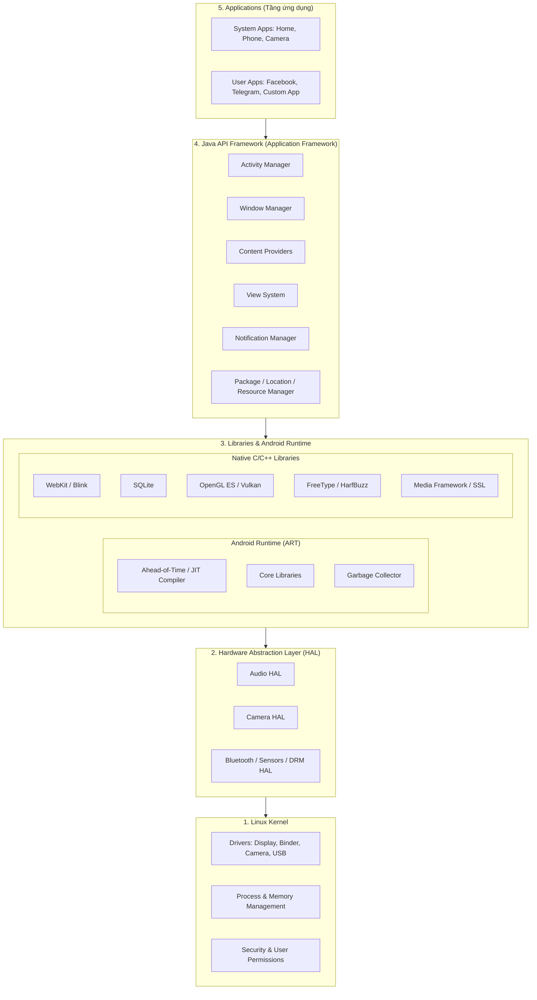

# Chương 1: Giới thiệu về Nền tảng Android (Android Platform Architecture)

---

## 1. Tổng quan Kiến trúc Android Platform

Android là một hệ điều hành mã nguồn mở (AOSP - Android Open Source Project) dựa trên nhân Linux. Hệ thống được tổ chức theo kiến trúc phân tầng (Layered Architecture) rõ ràng, giúp module hóa và phân tách trách nhiệm giữa phần cứng, runtime và các tầng ứng dụng cấp cao.

---

## 2. Chi tiết các tầng kiến trúc

### 2.1. Linux Kernel (Nhân Linux)

Android sử dụng nhân Linux (thường là phiên bản Linux LTS - Long Term Support) với các bản vá tùy biến (patch) từ Google:

- **Quản lý tài nguyên cơ bản:** Điều phối CPU (Process Scheduling), quản lý bộ nhớ ảo (Virtual Memory), network stack, quản lý năng lượng (Low Memory Killer - LMK, Wakelocks).
- **Hệ thống Driver phần cứng:** Trình điều khiển camera, display, Wi-Fi, audio, flash memory, USB.
- **Binder IPC Driver:** Đây là phần mở rộng nhân tối quan trọng do Android bổ sung. Binder là cơ chế truyền thông liên tiến trình (Inter-Process Communication - IPC) hiệu năng cao, dựa trên shared memory và memory mapping (`/dev/binder`), cho phép các tiến trình giao tiếp an toàn và nhanh hơn rất nhiều so với socket hay standard UNIX pipe.
- **Cơ chế Bảo mật (Security & Isolation):** 
  - Mỗi ứng dụng Android được hệ điều hành gán cho một **UID (Unique User ID)** riêng biệt trên Linux.
  - Áp dụng cơ chế **Application Sandbox**: Tiến trình của app A chạy độc lập trong không gian người dùng của UID A, không thể truy cập trực tiếp file hay bộ nhớ của app B trừ khi được cấp quyền thông qua Binder IPC hoặc ContentProvider.
  - Sử dụng **SELinux (Security-Enhanced Linux)** với chính sách Mandatory Access Control (MAC) nghiêm ngặt để phân quyền tài nguyên.

---

### 2.2. Hardware Abstraction Layer (HAL)

- **Vai trò:** Cung cấp giao diện chuẩn (Standard Interface API) dưới dạng C/C++ cho các nhà sản xuất phần cứng (OEMs như Samsung, Xiaomi, Qualcomm) hiện thực hóa mà không cần phải tiết lộ mã nguồn driver độc quyền.
- **Cách hoạt động:** Khi Java API Framework cần tương tác với phần cứng (ví dụ: Camera2 API chụp ảnh), nó sẽ gọi qua tầng HAL module tương ứng (`camera.device@3.4.so`).
- **Kiến trúc Treble (từ Android 8.0):** Tách biệt Android OS Framework khỏi Vendor Implementation (HAL) thông qua HIDL/AIDL, giúp cập nhật phiên bản Android nhanh hơn mà không cần chờ chip vendor biên dịch lại driver.

---

### 2.3. Native C/C++ Libraries & Android Runtime (ART)

#### A. Native C/C++ Libraries
Tầng này gồm các thư viện viết bằng C/C++ cung cấp khả năng xử lý hiệu năng cao:
- **Media Framework:** Dựa trên OpenCORE/Stagefright, hỗ trợ playback, recording cho MP3, AAC, H.264, VP9...
- **SurfaceFlinger:** Trình quản lý hiển thị (Compositor), trộn các bề mặt đồ họa (Surfaces) từ các ứng dụng khác nhau và vẽ trực tiếp vào Framebuffer.
- **SQLite:** Hệ quản trị cơ sở dữ liệu quan hệ nhúng, nhẹ, lưu trữ dạng file cục bộ (`.db`) cho mỗi ứng dụng.
- **OpenGL ES / Vulkan:** Bộ thư viện đồ họa 2D/3D phần cứng.
- **Bionic libc:** Thư viện C chuẩn tùy biến riêng cho Android (thay thế glibc của GNU/Linux), tối ưu hóa dung lượng nhỏ và tốc độ khởi động cho thiết bị nhúng.

#### B. Android Runtime: Sự tiến hóa từ Dalvik sang ART
Android không chạy file `.class` (Java Bytecode) thông thường của JVM, mà chuyển đổi sang định dạng `.dex` (Dalvik Executable) được tối ưu dung lượng và bộ nhớ cho thiết bị di động.

| Tiêu chí | Dalvik VM (Android < 5.0) | Android Runtime - ART (Android 5.0+) |
| :--- | :--- | :--- |
| **Kiến trúc** | Register-based virtual machine | Native compilation & Register-based |
| **Cơ chế biên dịch** | **JIT (Just-In-Time):** Biên dịch Bytecode sang mã máy (Machine Code) lúc runtime khi ứng dụng đang chạy. | **AOT (Ahead-of-Time)** khi cài đặt + **JIT & Profile-guided compilation** (từ Android 7.0+). |
| **Tốc độ khởi động app** | Chậm hơn, tốn CPU lúc chạy để compile. | Nhanh hơn vượt trội do mã máy đã được compile sẵn vào file `.oat` / `.vdex`. |
| **Dung lượng cài đặt** | Nhỏ gọn hơn. | Lớn hơn (do lưu thêm mã máy native). |
| **Mức tiêu hao pin** | Tốn pin hơn trong lúc chạy. | Tiết kiệm pin hơn (giảm tải CPU lúc runtime). |
| **Garbage Collection (GC)** | Nhiều lúc gây "giật lag" (Stop-the-world pauses). | GC cải tiến, phân đoạn ngắn hơn, giảm tối đa hiện tượng drop frame UI. |

#### C. Quy trình khởi tạo: Zygote Process
- **Zygote** là tiến trình mẹ trong Android, được khởi tạo khi hệ thống boot.
- Zygote nạp sẵn toàn bộ Core Java Classes và các thư viện cần thiết vào bộ nhớ RAM.
- Khi người dùng chạm mở một ứng dụng mới, Zygote chỉ cần thực hiện lệnh `fork()` để tạo ra một tiến trình mới copy-on-write (COW), giúp thời gian khởi động app giảm xuống hàng chục lần.

---

### 2.4. Java API Framework (Application Framework)

Đây là bộ khung API mà lập trình viên Android làm việc trực tiếp:
- **Activity Manager (AMS):** Điều khiển vòng đời của các Activity, quản lý Back Stack của ứng dụng.
- **Window Manager (WMS):** Quản lý các cửa sổ hiển thị, z-order, tương tác với SurfaceFlinger.
- **Content Providers:** Cơ chế cho phép chia sẻ dữ liệu an toàn giữa các tiến trình khác nhau (ví dụ: truy cập danh bạ hệ thống).
- **View System:** Bộ các UI Widget cơ bản (Button, TextView, ScrollView, Layouts...) và cơ chế dispatch sự kiện cảm ứng (Touch/Key Events).
- **Notification Manager:** Quản lý việc hiển thị thông báo trên thanh trạng thái (Status Bar) và Heads-up notifications.
- **Package Manager (PMS):** Quản lý việc cài đặt, gỡ cài đặt, kiểm tra quyền hạn (Permissions) của file `.apk`.
- **Resource Manager:** Cung cấp quyền truy cập vào các tài nguyên phi mã nguồn như Strings, Drawables, Layout XML files.

---

### 2.5. Applications (Tầng Ứng dụng)

Tầng cao nhất bao gồm:
1. **Core System Apps:** Ứng dụng tích hợp sẵn từ AOSP hoặc Google GMS (Dialer, SMS, Contacts, Browser, Settings).
2. **Third-party Apps:** Ứng dụng do lập trình viên bên thứ ba phát triển và người dùng cài đặt qua Google Play Store hoặc file APK.

---

## 3. Tóm tắt các khái niệm then chốt cần nhớ cho kỳ thi / vấn đáp

1. **Android dùng nhân gì?** Nhân Linux, bổ sung các module riêng: Binder IPC, Low Memory Killer, Ashmem.
2. **Tại sao Android không dùng chuẩn JVM của Oracle/Java?** Vì JVM chuẩn tốn nhiều bộ nhớ RAM và CPU; Android chuyển mã Java sang định dạng `.dex` chạy trên Dalvik/ART với kiến trúc Register-based tối ưu hơn cho phần cứng di động.
3. **Sự khác biệt cốt lõi giữa ART và Dalvik?** Dalvik sử dụng JIT (biên dịch lúc chạy); ART kết hợp AOT (biên dịch trước khi chạy) + JIT profile-guided giúp app chạy mượt hơn, giảm hao pin.
4. **Cơ chế Zygote là gì?** Tiến trình được nạp sẵn thư viện chung, khi cần mở app mới sẽ `fork()` tiến trình đó ra để khởi động cực nhanh.
5. **Cơ chế cách ly (Sandbox) hoạt động ra sao?** Mỗi app cài đặt được gán một Linux UID riêng biệt, ngăn chặn can thiệp bộ nhớ hoặc đọc file của nhau.
