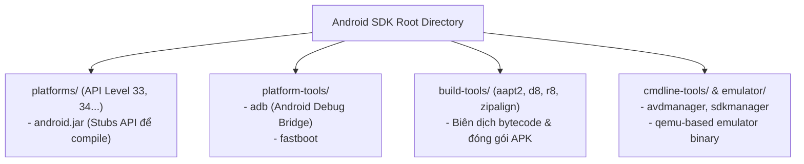
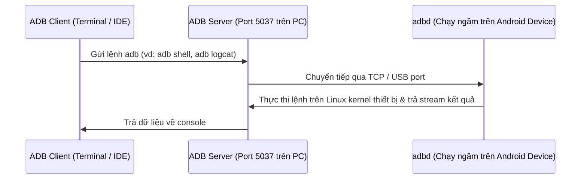

# Chương 2: Môi trường Phát triển Ứng dụng Android (Dev Environment & Tooling)

---

## 1. Hệ sinh thái Android SDK (Software Development Kit)

Để phát triển ứng dụng Android, Google cung cấp bộ công cụ **Android SDK** bao gồm các thành phần cốt lõi:



### 1.1. Các thành phần chính trong SDK

1. **SDK Platforms (`platforms/android-XX/`):**
   - Chứa file `android.jar`. File này chỉ chứa chữ ký (stubs) của các Class/Method trong Android framework để trình biên dịch Java/Kotlin kiểm tra cú pháp lúc compile. Mã thực thi thực sự nằm sẵn trên thiết bị (ROM Android).
2. **Platform Tools (`platform-tools/`):**
   - **`adb` (Android Debug Bridge):** Công cụ dòng lệnh giao tiếp client-server giữa máy tính phát triển và thiết bị di động/máy ảo.
   - **`fastboot`:** Công cụ giao tiếp ở chế độ bootloader để flash ROM/Kernel.
3. **Build Tools (`build-tools/XX.X.X/`):**
   - **AAPT2 (Android Asset Packaging Tool):** Biên dịch tài nguyên XML, nhúng icon/drawables và sinh file ánh xạ `R.java`.
   - **D8 / R8:** 
     - `D8`: Trình chuyển đổi mã Java Bytecode (`.class`) thành mã thực thi Android (`.dex`).
     - `R8`: Thay thế ProGuard, vừa chuyển đổi DEX vừa làm nhiệm vụ thu nhỏ mã nguồn (Shrinking/Tree-shaking), làm mờ mã nguồn (Obfuscation), và tối ưu hiệu năng bytecode.
   - **zipalign:** Căn chỉnh 4-byte bộ nhớ cho file `.apk` để hệ điều hành nạp app vào RAM hiệu quả hơn bằng lệnh `mmap()`.
   - **apksigner:** Ký điện tử file APK bằng keystore trước khi phát hành.

---

## 2. Android Debug Bridge (ADB) chuyên sâu

ADB là công cụ cực kỳ quen thuộc với dân Backend/DevOps khi làm việc với container hay Linux server. ADB hoạt động theo mô hình **Client - Server - Daemon**:



### Các câu lệnh ADB hữu ích hàng đầu
```bash
# Kiểm tra danh sách thiết bị đang kết nối
adb devices

# Truy cập Linux shell của thiết bị (tương tự SSH)
adb shell

# Cài đặt và gỡ cài đặt APK
adb install -r path/to/app.apk
adb uninstall com.example.myapp

# Chuyển file giữa máy tính và điện thoại
adb push local_file.txt /sdcard/
adb pull /sdcard/remote_file.txt ./

# Xem log hệ thống lọc theo Tag
adb logcat -s "MyActivityTag:D"

# Mô phỏng sự kiện phần cứng / ngắt mạng / đổi pin
adb shell dumpsys battery set level 10
adb shell am start -n com.example.myapp/.MainActivity
```

---

## 3. Máy ảo Android (Android Emulator & AVD)

- **AVD (Android Virtual Device):** Bản cấu hình phần cứng và phần mềm của máy ảo (màn hình, RAM, CPU, camera, phiên bản Android OS image).
- **Cơ chế hoạt động:** Dựa trên **QEMU** (Quick Emulator) mã nguồn mở.
- **Tăng tốc ảo hóa phần cứng (Hardware Acceleration):**
  - **Trên Windows:** Sử dụng **WHPX** (Windows Hypervisor Platform) tương thích với WSL2 / Docker Desktop, hoặc Intel **HAXM**.
  - **Trên Linux:** Sử dụng **KVM** (Kernel-based Virtual Machine) đạt hiệu năng gần như máy thật (Native speed).
- **Snapshot & Quick Boot:** Lưu dump trạng thái RAM của máy ảo xuống ổ đĩa, giúp khởi động lại emulator chỉ trong vòng 2-3 giây.

---

## 4. Công cụ Debugging & Quá trình tiến hóa từ DDMS

### 4.1. DDMS (Dalvik Debug Monitor Service) là gì?
- Trong các tài liệu đề cương cũ (và đề thi lý thuyết đại học), **DDMS** là công cụ đồ họa độc lập (standalone GUI tool) đi kèm SDK cũ.
- **Tính năng lịch sử của DDMS:**
  - Quản lý port forwarding giữa thiết bị và IDE.
  - Chụp ảnh màn hình thiết bị (Screen Capture).
  - Giám sát luồng (Thread monitoring) và vùng nhớ Heap (Heap inspection / GC trigger).
  - File Explorer (truy cập cây thư mục `/data/data/`, `/sdcard/`).
  - Giả lập cuộc gọi đến, gửi tin nhắn SMS giả lập, inject tọa độ GPS (Emulator Control).

### 4.2. Bộ công cụ hiện đại thay thế DDMS trong Android Studio
Google đã khai tử DDMS độc lập và tích hợp trực tiếp các tính năng này thành các Tool Window chuyên nghiệp trong Android Studio:

| Tính năng cũ trong DDMS | Công cụ thay thế trong Android Studio hiện đại |
| :--- | :--- |
| Logcat panel | **Logcat v2** (Hỗ trợ regex, key-value query: `package:mine level:debug tag:Network`) |
| File Explorer | **Device File Explorer** (Kéo thả duyệt file trong sandbox của app) |
| Heap / Memory Monitor | **Android Profiler (Memory Profiler)** - Trace Memory Leak, Record Java/Kotlin allocations |
| Thread Monitor | **Android Profiler (CPU Profiler / System Trace)** - Phân tích call stack, phát hiện nghẽn Main Thread |
| Network Sniffer | **Network Profiler** - Inspect toàn bộ HTTP request/response payloads, headers, timing |
| UI Hierarchy Dump | **Layout Inspector** (Kiểm tra cây View trực quan 3D theo thời gian thực) |

---

## 5. Cấu trúc Project Android & Hệ thống Build (Gradle)

Một dự án Android chuẩn sử dụng hệ thống build tự động hóa bằng **Gradle**:

```text
MyAndroidProject/
├── build.gradle.kts (Project-level)    # Cấu hình repository, plugins chung
├── settings.gradle.kts                 # Khai báo các modules trong project
├── app/                                # Module ứng dụng chính
│   ├── build.gradle.kts (App-level)    # Khai báo SDK version, dependencies, buildTypes
│   ├── src/
│   │   ├── main/
│   │   │   ├── AndroidManifest.xml     # "Hộ chiếu" của ứng dụng (đăng ký components, permissions)
│   │   │   ├── java/ (hoặc kotlin/)    # Mã nguồn code ứng dụng
│   │   │   └── res/                    # Tài nguyên tĩnh
│   │   │       ├── layout/             # Giao diện XML (activity_main.xml)
│   │   │       ├── values/             # strings.xml, colors.xml, themes.xml
│   │   │       ├── drawable/           # Icon, hình ảnh, vector xml
│   │   │       └── mipmap/             # App Launcher Icons theo các mật độ pixel (hdpi, xhdpi...)
```

### Các thông số quan trọng trong `build.gradle` (App-level)
- `compileSdk`: Phiên bản API dùng để biên dịch code (kiểm tra cú pháp lúc code).
- `minSdk`: Phiên bản Android tối thiểu thiết bị cần có để có thể cài đặt được app (nếu điện thoại người dùng có API thấp hơn thì Play Store sẽ chặn).
- `targetSdk`: Phiên bản Android mà lập trình viên đã kiểm thử và cam kết ứng dụng hoạt động tương thích với các chính sách bảo mật/hành vi mới nhất của Google.
- `applicationId`: Định danh duy nhất toàn cầu của ứng dụng (vd: `com.company.product`), đóng vai trò làm package name trên Google Play.

---

## 6. Câu hỏi ôn tập lý thuyết thường gặp

1. **Phân biệt `minSdkVersion`, `targetSdkVersion` và `compileSdkVersion`?**
2. **`adb` gồm những thành phần nào và giao tiếp qua cổng mặc định nào?** (Gồm client, server, daemon; port mặc định là 5037).
3. **File `R.java` là gì và do công cụ nào tự động sinh ra?** (`R.java` là file ánh xạ chứa các ID số nguyên dạng hex đại diện cho từng resource trong thư mục `res/`, do công cụ AAPT/AAPT2 sinh ra).
4. **Tại sao Android Studio lại bỏ DDMS?** Để tích hợp sâu, phân tích chi tiết theo thời gian thực trực tiếp trong IDE thông qua bộ Android Profiler mà không cần mở công cụ rời.
