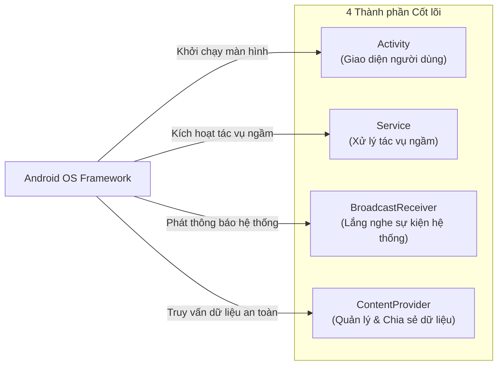
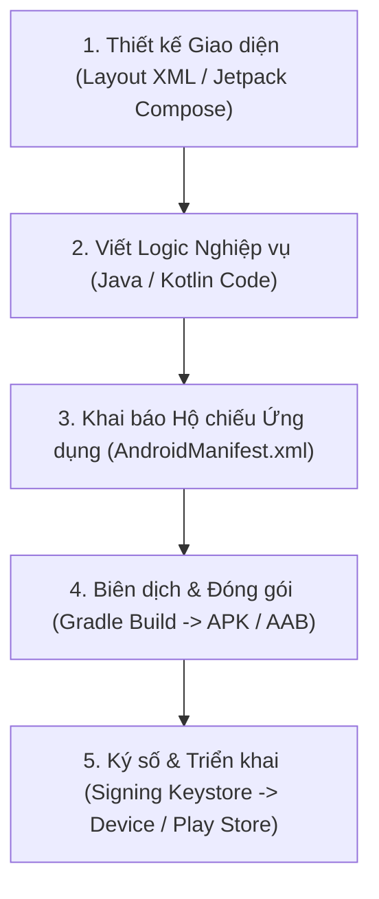

# Chương 3: 4 Thành phần Cốt lõi của Ứng dụng Android (Core Application Components)

---

## 1. Tổng quan về 4 Trụ cột Cốt lõi (The Big Four)

Khác với các ứng dụng desktop hoặc console thông thường chỉ có một hàm `main()` duy nhất làm điểm bắt đầu (Entry Point), ứng dụng Android không có hàm `main()`. Thay vào đó, Android OS tương tác với ứng dụng thông qua **4 thành phần cơ bản (Core Components)**. 

Hệ thống có thể kích hoạt độc lập từng thành phần này thông qua các thông điệp **Intent** hoặc lời gọi IPC từ Binder.



---

## 2. Chi tiết 4 Thành phần Cốt lõi

### 2.1. Activity (Thành phần Giao diện)
- **Mục đích:** Đại diện cho một màn hình đơn lẻ có giao diện người dùng (UI - User Interface).
- **Đặc điểm:**
  - Nơi người dùng trực tiếp tương tác (bấm nút, vuốt, nhập text).
  - Có vòng đời (Lifecycle) phức tạp gắn liền với trạng thái hiển thị của màn hình.
  - Một ứng dụng thường có nhiều Activity (ví dụ: `LoginActivity`, `HomeActivity`, `SettingsActivity`).
- **Khai báo bắt buộc trong `AndroidManifest.xml`:**
  ```xml
  <activity 
      android:name=".ui.MainActivity"
      android:exported="true">
      <intent-filter>
          <action android:name="android.intent.action.MAIN" />
          <category android:name="android.intent.category.LAUNCHER" />
      </intent-filter>
  </activity>
  ```

---

### 2.2. Service (Thành phần Chạy ngầm)
- **Mục đích:** Thực thi các tác vụ chạy ngầm dài hạn mà **không có giao diện người dùng**.
- **Lưu ý cực kỳ quan trọng:** Mặc định `Service` vẫn chạy trên **Main Thread (UI Thread)** của ứng dụng. Do đó, các tác vụ nặng (tải file, giải nén, tính toán) bắt buộc phải tạo Background Worker Thread / Coroutine riêng bên trong Service để tránh làm đơ ứng dụng (gây lỗi ANR - Application Not Responding).
- **Phân loại Service:**
  1. **Foreground Service:** Tác vụ mà người dùng nhận thức rõ ràng (ví dụ: phát nhạc Spotify, điều hướng Google Maps). Bắt buộc phải gắn liền với một Notification liên tục trên thanh thông báo.
  2. **Background Service:** Tác vụ chạy ngầm không cần người dùng theo dõi trực tiếp (từ Android 8.0 trở lên bị siết chặt quản lý pin; hiện nay khuyên dùng `WorkManager` để thay thế).
  3. **Bound Service:** Cho phép các thành phần khác (Activity hoặc app khác) "ràng buộc" (bind) vào để giao tiếp hai chiều theo mô hình Client-Server thông qua Binder IPC.
- **Khai báo trong Manifest:**
  ```xml
  <service android:name=".services.MusicPlayerService" />
  ```

---

### 2.3. BroadcastReceiver (Bộ thu phát Thông điệp Hệ thống)
- **Mục đích:** Lắng nghe và phản hồi các thông điệp phát thanh (Broadcasts) từ hệ điều hành hoặc từ các ứng dụng khác gửi tới.
- **Đặc điểm:**
  - Hoạt động như một Event Listener / Message Bus toàn hệ thống (tương tự kiến trúc Event-Driven trong Backend).
  - Không có giao diện người dùng, nhưng có thể khởi tạo một Notification hoặc đánh thức một Job.
  - Vòng đời cực ngắn: phương thức `onReceive()` chạy trong tối đa 10 giây trên Main Thread, sau đó Receiver bị hủy.
- **Ví dụ các sự kiện thường nghe:**
  - Hệ thống pin yếu (`ACTION_BATTERY_LOW`).
  - Thiết bị vừa cắm sạc hoặc rút sạc (`ACTION_POWER_CONNECTED`).
  - Trạng thái kết nối mạng thay đổi (`CONNECTIVITY_ACTION`).
  - Thiết bị khởi động xong (`ACTION_BOOT_COMPLETED`).
- **Cách đăng ký:**
  - **Static (Tĩnh):** Đăng ký trong `AndroidManifest.xml` (bị hạn chế nhiều từ Android 8+ để tiết kiệm pin).
  - **Dynamic (Động):** Đăng ký trong mã nguồn Java/Kotlin bằng `registerReceiver()` và hủy bằng `unregisterReceiver()`.

---

### 2.4. ContentProvider (Thành phần Quản lý và Chia sẻ Dữ liệu)
- **Mục đích:** Quản lý quyền truy cập vào kho dữ liệu cấu trúc (thường là SQLite database hoặc file) và cung cấp cơ chế bảo mật để chia sẻ dữ liệu này giữa các ứng dụng độc lập khác nhau.
- **Cách thức hoạt động:**
  - Trừu tượng hóa dữ liệu thông qua định dạng chuẩn **URI (Uniform Resource Identifier)**:
    `content://com.example.provider/table_name/id`
  - Client bên ngoài dùng `ContentResolver` để thực hiện các thao tác CRUD chuẩn:
    - `query()`
    - `insert()`
    - `update()`
    - `delete()`
- **Ứng dụng thực tế phổ biến:** Truy cập danh bạ người dùng (`ContactsContract`), thư viện hình ảnh (`MediaStore`), nhật ký cuộc gọi.

---

## 3. Bảng So sánh Tổng hợp 4 Thành phần

| Thành phần | Có Giao diện (UI)? | Vòng đời | Phương thức kích hoạt |
| :--- | :--- | :--- | :--- |
| **Activity** | Có | Theo trạng thái tương tác của người dùng | `startActivity(intent)` |
| **Service** | Không | Dài, chạy độc lập với giao diện | `startService(intent)` / `bindService()` |
| **BroadcastReceiver** | Không | Rất ngắn (thời gian xử lý `onReceive`) | `sendBroadcast(intent)` |
| **ContentProvider** | Không | Theo chu kỳ của tiến trình chứa nó | `ContentResolver.query()` qua Content URI |

---

## 4. Các Bước và Luồng Xây dựng Ứng dụng Android



### Vai trò của file `AndroidManifest.xml`
File này được hệ điều hành đọc đầu tiên khi người dùng cài đặt ứng dụng:
1. Đặt tên package và phiên bản ứng dụng.
2. Khai báo **mọi thành phần**: Mọi Activity, Service, ContentProvider, BroadcastReceiver (tĩnh) nếu không khai báo trong Manifest sẽ **bị hệ thống từ chối khởi chạy** (ném ra lỗi runtime exception).
3. Khai báo các quyền hạn (Permissions) mà ứng dụng cần (Internet, Camera, Location...).
4. Khai báo các yêu cầu phần cứng (Hardware Features) như thiết bị phải có GPS, Bluetooth LE hoặc Camera để chạy được app.

---

## 5. Câu hỏi ôn tập then chốt

1. **Kể tên 4 thành phần cơ bản của Android và chức năng chính của từng loại?**
2. **Service có chạy trên thread riêng biệt không?** (Không! Mặc định Service chạy trên Main UI Thread. Muốn chạy tác vụ nặng phải tự spawn Thread hoặc Coroutine).
3. **Cơ chế nào cho phép chia sẻ dữ liệu an toàn giữa 2 ứng dụng độc lập trong Android?** (ContentProvider kết hợp Binder IPC).
4. **Điều gì sẽ xảy ra nếu khởi chạy một Activity mà quên khai báo trong `AndroidManifest.xml`?** (Ứng dụng sẽ bị crash ngay lập tức với lỗi `ActivityNotFoundException`).
