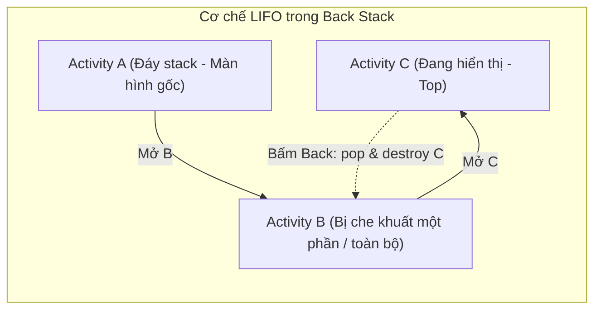
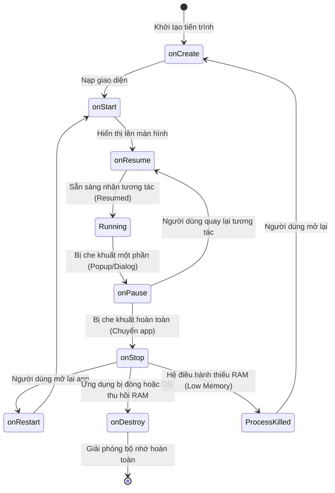
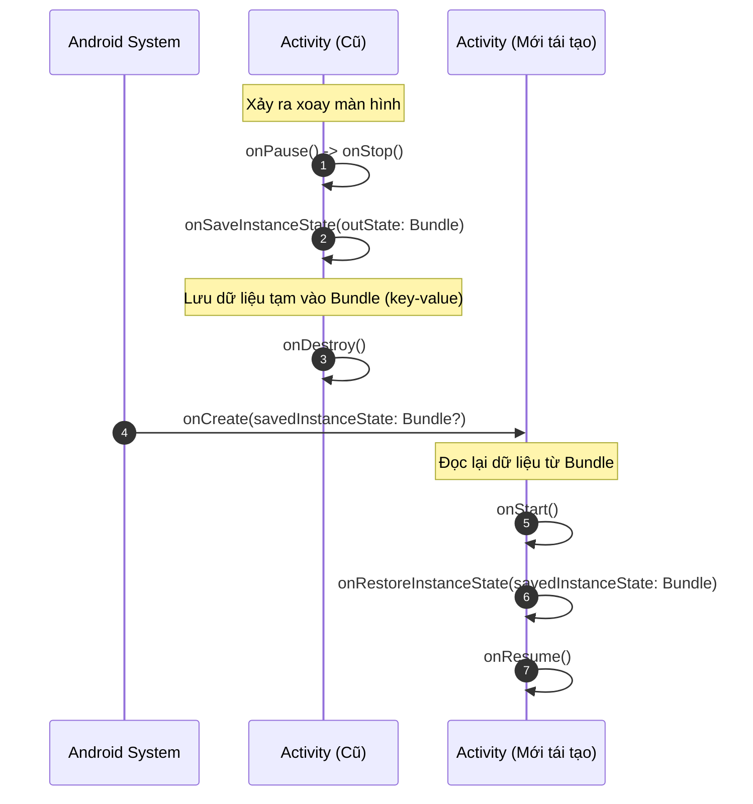

# Chương 4: Activity Class & Quản lý Vòng đời (Activity Lifecycle & Tasks)

---

## 1. Bản chất của Activity & Cơ chế Back Stack

### 1.1. Activity là gì?
- `Activity` là một lớp cơ sở kế thừa từ `ContextThemeWrapper` -> `ContextWrapper` -> `Context`.
- Đại diện cho một cửa sổ (Window) đơn lẻ mà ứng dụng hiển thị giao diện người dùng lên đó thông qua phương thức `setContentView(R.layout.activity_main)`.

### 1.2. Tasks & Back Stack (Hàng đợi ngăn xếp)
- **Task:** Là một tập hợp các Activity mà người dùng tương tác khi thực hiện một công việc nhất định.
- **Back Stack:** Hoạt động theo cấu trúc ngăn xếp **LIFO (Last In, First Out)**.
  - Khi một Activity mới được mở (`startActivity`), nó được **push** lên đỉnh của Back Stack.
  - Khi người dùng bấm nút **Back** (hoặc gọi lệnh `finish()`), Activity ở đỉnh ngăn xếp sẽ bị **pop** ra, hủy bỏ và giải phóng bộ nhớ, đưa Activity trước đó quay trở lại trạng thái hiển thị.



### 1.3. Các chế độ khởi chạy (Launch Modes)
Được cấu hình thông qua thuộc tính `android:launchMode` trong `AndroidManifest.xml` hoặc thông qua các cờ `Intent.FLAG_ACTIVITY_*`:

1. **`standard` (Mặc định):** Mỗi lần gọi `startActivity()`, hệ thống luôn tạo một instance (đối tượng) mới của Activity đó và đặt lên đỉnh stack, bất kể nó đã tồn tại trong stack hay chưa.
2. **`singleTop`:** Nếu một instance của Activity đó **đang nằm ở đỉnh stack**, hệ thống sẽ không tạo mới mà tái sử dụng instance đó thông qua phương thức `onNewIntent(intent)`. Nếu nó không nằm ở đỉnh, hệ thống vẫn tạo mới bình thường.
3. **`singleTask`:** Hệ thống sẽ tìm trong stack xem Activity đó đã tồn tại chưa:
   - Nếu chưa có: Tạo mới trong một Task mới (hoặc task hiện tại).
   - Nếu đã có: Hệ thống sẽ **pop và destroy tất cả các Activity nằm phía trên nó** để đưa nó lên đỉnh stack, đồng thời gọi `onNewIntent()`.
4. **`singleInstance`:** Tương tự `singleTask`, nhưng hệ thống đảm bảo Task chứa Activity này sẽ **chỉ chứa duy nhất một mình nó**, không có bất kỳ Activity nào khác được phép vào chung Task này.

---

## 2. Vòng đời của Activity (Activity Lifecycle)

Vòng đời của Activity là kiến thức **quan trọng bậc nhất** trong lập trình Android, quyết định sự ổn định và tối ưu tài nguyên của ứng dụng.



### 2.1. Chi tiết 7 Phương thức Callback Vòng đời

| Callback | Tần suất gọi | Mô tả hành vi | Việc NÊN làm tại đây |
| :--- | :--- | :--- | :--- |
| **`onCreate()`** | 1 lần duy nhất khi tạo mới | Activity được tạo trong bộ nhớ, chưa hiển thị. | - Gọi `setContentView()`.<br/>- Ánh xạ View / Khởi tạo ViewBinding.<br/>- Khởi tạo ViewModel, biến toàn cục, kết nối ban đầu. |
| **`onStart()`** | Mỗi khi màn hình xuất hiện | Activity bắt đầu hiển thị trên màn hình nhưng **chưa thể tương tác** được với người dùng. | - Đăng ký các BroadcastReceiver lắng nghe UI.<br/>- Bắt đầu quan sát dữ liệu. |
| **`onResume()`** | Mỗi khi sẵn sàng tương tác | Activity nằm ở đỉnh stack, người dùng có thể chạm, vuốt, gõ chữ. | - Khởi động camera preview.<br/>- Kích hoạt cảm biến (sensor).<br/>- Bắt đầu chạy animation / âm thanh. |
| **`onPause()`** | Khi bị mất focus một phần | Activity vẫn nhìn thấy một phần nhưng không còn nhận tương tác (vd: có Dialog che phía trên, chia đôi màn hình Multi-window). | - Tạm dừng animation.<br/>- Tạm dừng ghi âm/video.<br/>- **Không** thực hiện các tác vụ nặng làm chậm việc mở màn hình mới. |
| **`onStop()`** | Khi bị che khuất hoàn toàn | Activity hoàn toàn không còn nhìn thấy (người dùng bấm Home hoặc chuyển sang Activity khác). | - Hủy đăng ký lắng nghe GPS, cảm biến để tiết kiệm pin.<br/>- Lưu dữ liệu tạm xuống bộ nhớ cục bộ (nếu cần). |
| **`onRestart()`** | Khi quay lại từ trạng thái Stop | Gọi sau `onStop()` ngay trước khi `onStart()` được gọi lại. | - Thực hiện các logic đặc thù khi người dùng trở lại màn hình. |
| **`onDestroy()`** | 1 lần duy nhất khi bị hủy | Activity chuẩn bị bị dọn sạch khỏi bộ nhớ RAM (do gọi `finish()` hoặc do OS kill để giải phóng RAM). | - Dọn dẹp tài nguyên rò rỉ (Memory Leaks).<br/>- Hủy các subscription, ngắt kết nối WebSocket/Database. |

---

## 3. Hiện tượng Thay đổi Cấu hình (Configuration Changes)

### 3.1. Vấn đề Xoay màn hình
- Khi người dùng xoay điện thoại từ Dọc sang Ngang (Portrait sang Landscape), hoặc đổi ngôn ngữ hệ thống, Android OS mặc định sẽ **HỦY TOÀN BỘ Activity hiện tại (`onDestroy`) và KHỞI TẠO LẠI từ đầu (`onCreate`)** để nạp lại tài nguyên phù hợp từ thư mục `res/layout-land/`.
- **Hệ quả:** Dữ liệu người dùng đang nhập dở (nếu không lưu) hoặc trạng thái biến tạm sẽ bị reset về ban đầu.

### 3.2. Cơ chế Lưu và Khôi phục Trạng thái (State Restoration)



#### Code minh họa (Kotlin):
```kotlin
class CounterActivity : AppCompatActivity() {
    private var score = 0

    override fun onCreate(savedInstanceState: Bundle?) {
        super.onCreate(savedInstanceState)
        setContentView(R.layout.activity_counter)

        // Cách 1: Khôi phục trực tiếp trong onCreate
        if (savedInstanceState != null) {
            score = savedInstanceState.getInt("KEY_SCORE", 0)
        }
    }

    // Được gọi trước khi Activity bị hủy do configuration change hoặc OS kill
    override fun onSaveInstanceState(outState: Bundle) {
        super.onSaveInstanceState(outState)
        outState.putInt("KEY_SCORE", score)
    }

    // Cách 2: Khôi phục trong onRestoreInstanceState (gọi sau onStart)
    override fun onRestoreInstanceState(savedInstanceState: Bundle) {
        super.onRestoreInstanceState(savedInstanceState)
        score = savedInstanceState.getInt("KEY_SCORE", 0)
    }
}
```

> [!NOTE]
> **Hiện đại hóa với Android Jetpack ViewModel:**
> Hiện nay, việc lưu trữ dữ liệu qua màn hình xoay thường được ủy quyền cho **`ViewModel`**. Đối tượng `ViewModel` được thiết kế để sống sót qua chu kỳ Configuration Change, chỉ bị hủy khi Activity thực sự kết thúc (`finish()`).

---

## 4. Câu hỏi ôn tập then chốt

1. **Thứ tự gọi lifecycle khi chuyển từ Activity A sang Activity B?**
   - Thứ tự: `A.onPause()` -> `B.onCreate()` -> `B.onStart()` -> `B.onResume()` -> `A.onStop()`.
   - *Lưu ý:* `A.onPause()` luôn chạy trước khi B được tạo. Do đó nếu viết code quá nặng trong `onPause()` sẽ làm chậm tốc độ mở màn hình mới.
2. **Khác biệt giữa `onPause()` và `onStop()`?**
   - `onPause()`: Activity vẫn còn nhìn thấy được (nhưng mất focus).
   - `onStop()`: Activity bị che khuất 100% không còn nhìn thấy.
3. **Tại sao khi xoay màn hình thì biến trong Activity lại bị mất giá trị?**
   - Do hệ điều hành mặc định sẽ destroy và recreate lại toàn bộ instance của Activity để nạp tài nguyên mới tương ứng với orientation mới.
4. **Trình bày sự khác nhau giữa `standard` và `singleTop` launch mode?**
