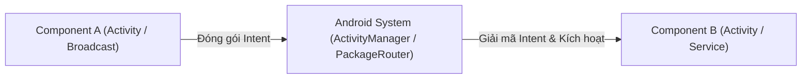
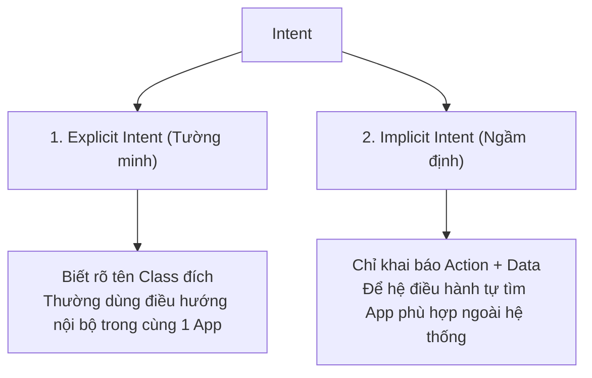

# Chương 5: Lớp Intent & Điều hướng Ứng dụng (Intent Class & Navigation)

---

## 1. Intent là gì? Cấu trúc của một Intent

### 1.1. Bản chất của Intent
- **Intent** (Ý định) là một đối tượng nhắn tin bất đồng bộ đại diện cho một "yêu cầu hành động" được gửi tới hệ thống Android để kích hoạt một thành phần ứng dụng (Activity, Service hoặc BroadcastReceiver).
- Tương tự như cơ chế Message Broker hoặc HTTP Request Router trong Backend, Intent cho phép các thành phần giao tiếp và truyền dữ liệu cho nhau dù chúng nằm trong cùng một ứng dụng hay giữa hai ứng dụng hoàn toàn độc lập.



### 1.2. Cấu trúc của một đối tượng Intent
Một đối tượng Intent có thể chứa 6 thuộc tính cấu thành:

| Thuộc tính | Kiểu dữ liệu | Ý nghĩa | Ví dụ |
| :--- | :--- | :--- | :--- |
| **Component Name** | `ComponentName` | Chỉ định chính xác class mục tiêu sẽ nhận Intent (dùng cho Explicit Intent). | `com.example.app.DetailActivity` |
| **Action** | `String` | Hành động chung mà bạn muốn hệ thống thực hiện. | `ACTION_VIEW`, `ACTION_DIAL`, `ACTION_SEND` |
| **Data & Type** | `Uri` / `String` | URI trỏ tới dữ liệu cần xử lý và MIME type của dữ liệu đó. | `tel:0901234567`, `https://google.com`, `image/png` |
| **Category** | `Set<String>` | Cung cấp thông tin phụ trợ về ngữ cảnh của component nhận Intent. | `CATEGORY_LAUNCHER`, `CATEGORY_BROWSABLE` |
| **Extras** | `Bundle` | Tập hợp dữ liệu dạng key-value đính kèm thêm để truyền sang đích đến. | `putExtra("USER_ID", 123)` |
| **Flags** | `Int` | Các cờ chỉ dẫn hệ điều hành cách quản lý Task và Back Stack. | `FLAG_ACTIVITY_CLEAR_TOP`, `FLAG_ACTIVITY_NEW_TASK` |

---

## 2. Phân loại Intent: Explicit vs Implicit Intent



### 2.1. Explicit Intent (Intent Tường minh)
- Được sử dụng khi bạn biết chính xác Class nào sẽ xử lý Intent (thường là chuyển trang nội bộ trong cùng một app).
- Không cần thông qua cơ chế lọc của hệ điều hành.

```kotlin
// Khởi tạo Intent tường minh chuyển từ MainActivity sang DetailActivity
val intent = Intent(this, DetailActivity::class.java).apply {
    putExtra("EXTRA_PRODUCT_ID", 402)
    putExtra("EXTRA_PRODUCT_NAME", "Laptop Dell XPS")
}
startActivity(intent)
```

---

### 2.2. Implicit Intent (Intent Ngầm định)
- Không chỉ định rõ component nào sẽ nhận, mà chỉ nêu lên **ý định (Action)** và **dữ liệu (Data)**.
- Hệ điều hành Android sẽ quét toàn bộ các app đã cài đặt trên máy để tìm ra những app có khả năng xử lý Intent này. Nếu có nhiều hơn một app, hệ thống sẽ hiện hộp thoại **App Chooser** để người dùng chọn.

#### Một số ví dụ Implicit Intent kinh điển:
```kotlin
// 1. Mở trình duyệt web
val webIntent = Intent(Intent.ACTION_VIEW, Uri.parse("https://github.com"))
startActivity(webIntent)

// 2. Mở màn hình quay số điện thoại (chưa gọi)
val dialIntent = Intent(Intent.ACTION_DIAL, Uri.parse("tel:0912345678"))
startActivity(dialIntent)

// 3. Mở bản đồ Google Maps tại tọa độ GPS
val mapIntent = Intent(Intent.ACTION_VIEW, Uri.parse("geo:10.762622,106.660172?z=15"))
startActivity(mapIntent)

// 4. Chia sẻ văn bản qua mạng xã hội (Share Sheet)
val shareIntent = Intent(Intent.ACTION_SEND).apply {
    type = "text/plain"
    putExtra(Intent.EXTRA_TEXT, "Chào bạn, đây là link roadmap Android: https://example.com")
}
startActivity(Intent.createChooser(shareIntent, "Chia sẻ qua:"))
```

---

## 3. Intent Resolution & Intent Filters

Để một Activity có thể đón nhận các **Implicit Intent** từ bên ngoài, nó phải khai báo các bộ lọc **`<intent-filter>`** bên trong file `AndroidManifest.xml`:

```xml
<activity android:name=".ui.ShareActivity" android:exported="true">
    <intent-filter>
        <!-- Khai báo Action chấp nhận -->
        <action android:name="android.intent.action.SEND" />
        
        <!-- Bắt buộc phải có CATEGORY_DEFAULT để nhận Implicit Intent -->
        <category android:name="android.intent.category.DEFAULT" />
        
        <!-- Khai báo định dạng dữ liệu có thể xử lý -->
        <data android:mimeType="text/plain" />
        <data android:mimeType="image/*" />
    </intent-filter>
</activity>
```

> [!WARNING]
> **Bảo mật với thuộc tính `android:exported` (từ Android 12+):**
> Nếu một Activity có chứa `<intent-filter>`, bắt buộc phải khai báo rõ `android:exported="true"` (nếu cho phép các app khác gọi) hoặc `android:exported="false"` (chỉ nội bộ app dùng). Nếu bỏ quên, ứng dụng sẽ bị build lỗi.

---

## 4. Cơ chế Truyền Nhận Dữ liệu Nâng cao: Serializable vs Parcelable

Khi cần truyền một Object tùy biến qua Intent (ví dụ: `User`, `Order`), dữ liệu phải được tuần tự hóa (Serialize):

| Tiêu chí | `java.io.Serializable` | `android.os.Parcelable` |
| :--- | :--- | :--- |
| **Nguồn gốc** | Chuẩn Java thuần có sẵn | Tối ưu hóa riêng cho Android IPC / Binder |
| **Cơ chế hoạt động** | Sử dụng **Java Reflection** để quét cấu trúc Object lúc runtime. | Lập trình viên định nghĩa chính xác cách ghi/đọc từng byte vào bộ nhớ (`Parcel`). |
| **Tốc độ thực thi** | **Chậm** (do chi phí reflection cao, sinh nhiều rác bộ nhớ). | **Cực nhanh** (gấp 10 lần Serializable). |
| **Độ phức tạp code** | Cực đơn giản (chỉ cần `implements Serializable`). | Trước đây phải viết nhiều boilerplate code; nay với Kotlin chỉ cần thêm annotation `@Parcelize`. |

#### Code ví dụ chuẩn hiện đại với Kotlin `@Parcelize`:
```kotlin
// File build.gradle.kts: thêm plugin id("kotlin-parcelize")

import android.os.Parcelable
import kotlinx.parcelize.Parcelize

@Parcelize
data class User(
    val id: String,
    val username: String,
    val email: String,
    val age: Int
) : Parcelable

// Gửi đi từ Activity A:
val intent = Intent(this, ProfileActivity::class.java).apply {
    putExtra("EXTRA_USER_DATA", User("U01", "tuandev", "tuan@example.com", 24))
}
startActivity(intent)

// Nhận tại Activity B:
val user = if (Build.VERSION.SDK_INT >= Build.VERSION_CODES.TIRAMISU) {
    intent.getParcelableExtra("EXTRA_USER_DATA", User::class.java)
} else {
    @Suppress("DEPRECATION")
    intent.getParcelableExtra<User>("EXTRA_USER_DATA")
}
```

---

## 5. Nhận kết quả trả về từ Activity (Activity Result API)

### 5.1. Cách tiếp cận cũ (Đã bị Deprecated)
Trước đây, để nhận kết quả từ Activity con (ví dụ: mở màn hình chọn ảnh rồi nhận ảnh trả về), người ta dùng:
- `startActivityForResult(intent, REQUEST_CODE)`
- Ghi đè callback: `onActivityResult(requestCode, resultCode, data)`
- *Nhược điểm:* Quản lý nhiều `REQUEST_CODE` bằng tay rất dễ nhầm lẫn, code bị phân mảnh khi số lượng màn hình tăng lên.

### 5.2. Chuẩn Hiện đại: Activity Result API (`registerForActivityResult`)
Sử dụng các Hợp đồng chuẩn hóa (Contracts), code ngắn gọn, type-safe và tự động gắn kết với Lifecycle của Activity:

```kotlin
class MainActivity : AppCompatActivity() {

    // 1. Đăng ký nhận kết quả trước khi Activity hiển thị
    private val selectUserLauncher = registerForActivityResult(
        ActivityResultContracts.StartActivityForResult()
    ) { result ->
        if (result.resultCode == Activity.RESULT_OK) {
            val data = result.data
            val selectedUserId = data?.getStringExtra("RETURNED_USER_ID")
            Toast.makeText(this, "Đã chọn User ID: $selectedUserId", Toast.LENGTH_SHORT).show()
        }
    }

    override fun onCreate(savedInstanceState: Bundle?) {
        super.onCreate(savedInstanceState)
        setContentView(R.layout.activity_main)

        findViewById<Button>(R.id.btnPickUser).setOnClickListener {
            // 2. Kích hoạt mở màn hình chọn
            val intent = Intent(this, UserSelectionActivity::class.java)
            selectUserLauncher.launch(intent)
        }
    }
}
```

---

## 6. Câu hỏi ôn tập then chốt

1. **Phân biệt Explicit Intent và Implicit Intent? Cho ví dụ thực tế của từng loại?**
2. **Tại sao Android khuyên dùng `Parcelable` thay vì `Serializable` khi truyền đối tượng giữa các Activity?**
3. **Thẻ `<intent-filter>` đóng vai trò gì và những thuộc tính nào là bắt buộc khi định nghĩa một filter cho Implicit Intent?** (Bắt buộc phải có `<action>` và `<category android:name="android.intent.category.DEFAULT" />`).
4. **Trình bày cách tiếp cận hiện đại thay thế cho `startActivityForResult`?** (Sử dụng `registerForActivityResult` cùng `ActivityResultContracts`).
