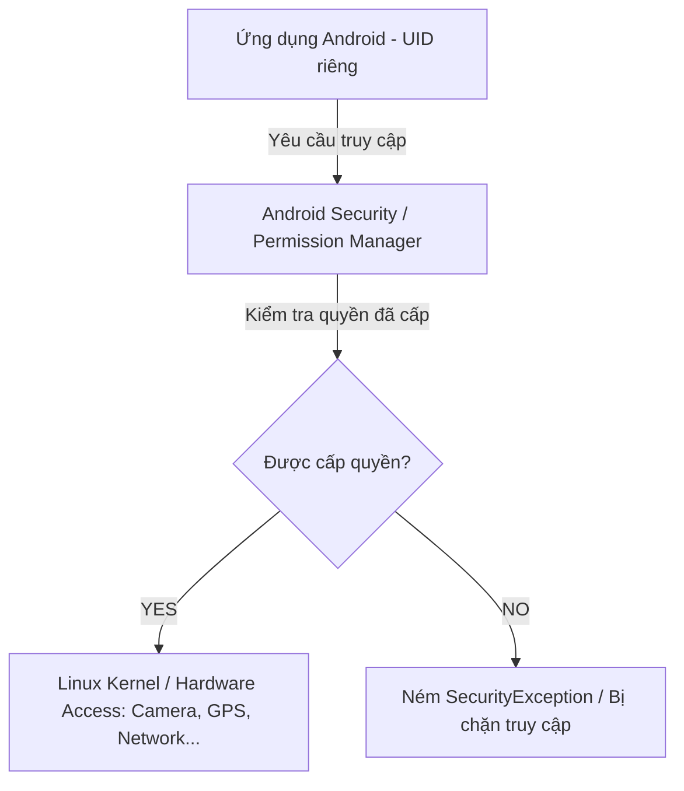
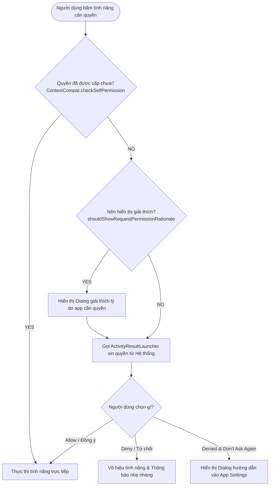

# Chương 6: Hệ thống Quyền truy cập (Android Permissions)

Hệ thống cấp quyền (Permission System) là lớp phòng thủ cốt lõi của Android nhằm bảo vệ quyền riêng tư của người dùng (User Privacy) và sự toàn vẹn của hệ thống (System Integrity). Bất kỳ hành động nào truy cập vào dữ liệu nhạy cảm (danh bạ, vị trí, tin nhắn, ảnh) hoặc phần cứng thiết bị (camera, microphone, bluetooth) đều phải thông qua cơ chế kiểm soát quyền này.

---

## 6.1 Khái niệm và Kiến trúc Android Permission

### 1. Nguyên lý Hoạt động & Sandbox Cấp Hệ thống
- Mỗi ứng dụng Android chạy bên trong một **Linux Sandbox** độc lập với một User ID (`UID`) riêng biệt.
- Mặc định, ứng dụng không có quyền truy cập vào tài nguyên của các ứng dụng khác cũng như các dịch vụ phần cứng nhạy cảm của hệ điều hành.
- **Permission** đóng vai trò là "chiếc chìa khóa" khai báo và yêu cầu hệ thống cấp phép mở rộng ranh giới Sandbox của ứng dụng.
- Dưới tầng Linux Kernel, các quyền phần cứng được map với các Linux Group ID (`GID`) tương ứng (ví dụ: quyền truy cập mạng sẽ thêm UID của app vào nhóm `inet`).



### 2. Nguyên tắc Tối thiểu hóa Đặc quyền (Least Privilege)
Chỉ yêu cầu những quyền **thực sự cần thiết** cho tính năng cốt lõi của ứng dụng.
- Nếu chỉ cần chụp một tấm ảnh đại diện: Dùng **Implicit Intent** (`MediaStore.ACTION_IMAGE_CAPTURE`) hoặc **Photo Picker** của hệ thống thay vì xin toàn bộ quyền `CAMERA` hoặc `READ_EXTERNAL_STORAGE`.
- Nếu chỉ cần chọn file: Dùng Storage Access Framework (`ACTION_OPEN_DOCUMENT`).

---

## 6.2 Khai báo Quyền trong AndroidManifest.xml

Tất cả các quyền mà ứng dụng muốn sử dụng đều **bắt buộc** phải được khai báo trước trong tệp `AndroidManifest.xml` thông qua thẻ `<uses-permission>`.

```xml
<manifest xmlns:android="http://schemas.android.com/apk/res/android"
    package="com.example.myapp">

    <!-- Quyền truy cập Internet (Normal Permission) -->
    <uses-permission android:name="android.permission.INTERNET" />
    <uses-permission android:name="android.permission.ACCESS_NETWORK_STATE" />

    <!-- Quyền truy cập vị trí (Dangerous / Runtime Permission) -->
    <uses-permission android:name="android.permission.ACCESS_FINE_LOCATION" />
    <uses-permission android:name="android.permission.ACCESS_COARSE_LOCATION" />

    <!-- Quyền Camera -->
    <uses-permission android:name="android.permission.CAMERA" />

    <!-- Yêu cầu thiết bị phải có phần cứng Camera nếu bắt buộc -->
    <uses-feature android:name="android.hardware.camera" android:required="false" />

    <application ...>
        ...
    </application>
</manifest>
```

> [!IMPORTANT]
> Nếu bạn gọi API yêu cầu một quyền nguy hiểm (ví dụ: lấy tọa độ GPS) mà **quên khai báo thẻ `<uses-permission>` trong Manifest**, ứng dụng sẽ ném ngoại lệ `java.lang.SecurityException` và crash ngay lập tức, kể cả khi bạn có viết code xin quyền động.

---

## 6.3 Phân loại Quyền (Protection Levels)

Android phân chia các quyền thành các mức độ bảo vệ (`protectionLevel`) khác nhau:

| Loại quyền (Permission Type) | Mức độ nguy cơ | Thời điểm cấp quyền | Cách cấp | Ví dụ điển hình |
| :--- | :--- | :--- | :--- | :--- |
| **Normal Permissions** (Quyền thông thường) | Thấp (Không xâm phạm đời tư người dùng) | Lúc cài đặt ứng dụng (Install-time) | Tự động bởi hệ thống | `INTERNET`, `ACCESS_NETWORK_STATE`, `SET_ALARM`, `VIBRATE`, `WAKE_LOCK` |
| **Dangerous Permissions** (Quyền nguy hiểm / Runtime) | Cao (Truy cập dữ liệu cá nhân hoặc thiết bị phần cứng) | Lúc ứng dụng đang chạy (Runtime - từ Android 6.0 Marshmallow, API 23) | Người dùng tự tay bấm "Allow" trên hộp thoại | `ACCESS_FINE_LOCATION`, `CAMERA`, `RECORD_AUDIO`, `READ_CONTACTS`, `READ_CALENDAR` |
| **Special Permissions** (Quyền đặc biệt) | Rất cao (Có thể ảnh hưởng sâu đến toàn bộ hệ thống) | Chuyển hướng người dùng vào trang Cài đặt hệ thống (System Settings) | Người dùng bật thủ công trong Settings | `SYSTEM_ALERT_WINDOW` (Vẽ đè lên app khác), `WRITE_SETTINGS`, `MANAGE_EXTERNAL_STORAGE` |
| **Signature Permissions** | Cực cao (Dành cho hệ thống hoặc giữa các app cùng nhà phát triển) | Lúc cài đặt | Tự động cấp nếu app yêu cầu được ký cùng Keystore với app khai báo | Custom Permissions giữa các ứng dụng nội bộ trong cùng hệ sinh thái |

---

## 6.4 Nhóm quyền (Permission Groups)

Các quyền liên quan mật thiết với nhau được gom thành từng **Permission Group**. Khi người dùng cấp một quyền trong nhóm, các quyền khác cùng nhóm có thể được hệ thống cấp tự động trong cùng session (tuy nhiên lập trình viên không được dựa dẫm vào cơ chế này mà phải luôn kiểm tra độc lập từng quyền):

- **LOCATION**: `ACCESS_FINE_LOCATION`, `ACCESS_COARSE_LOCATION`, `ACCESS_BACKGROUND_LOCATION`.
- **CAMERA**: `CAMERA`.
- **MICROPHONE**: `RECORD_AUDIO`.
- **CONTACTS**: `READ_CONTACTS`, `WRITE_CONTACTS`, `GET_ACCOUNTS`.
- **CALENDAR**: `READ_CALENDAR`, `WRITE_CALENDAR`.
- **STORAGE** (Dưới Android 13): `READ_EXTERNAL_STORAGE`, `WRITE_EXTERNAL_STORAGE`.

---

## 6.5 Quy trình Xin Quyền Động (Runtime Permissions) Hiện Đại

Bắt đầu từ Android 6.0 (API 23), việc khai báo trong Manifest là chưa đủ đối với Dangerous Permissions. Ứng dụng phải thực hiện quy trình xin quyền tại thời điểm người dùng kích hoạt tính năng tương ứng.

### 1. Lưu đồ Quy trình Chuẩn (Standard Permission Flow)



### 2. Triển khai bằng Kotlin với `ActivityResultContracts` (Hiện đại)

Cách tiếp cận cũ dùng `requestPermissions()` và `onRequestPermissionsResult()` trong Activity đã bị **Deprecated**. Chuẩn hiện đại của Android Jetpack là sử dụng **Activity Result API**:

```kotlin
class CameraActivity : AppCompatActivity() {

    private lateinit var binding: ActivityCameraBinding

    // 1. Đăng ký ActivityResultLauncher trước khi Activity chuyển sang trạng thái RESUMED
    private val requestCameraPermissionLauncher = registerForActivityResult(
        ActivityResultContracts.RequestPermission()
    ) { isGranted: Boolean ->
        if (isGranted) {
            // Người dùng đã bấm Cấp quyền (Allow)
            openCamera()
        } else {
            // Người dùng bấm Từ chối (Deny)
            if (!ActivityCompat.shouldShowRequestPermissionRationale(this, Manifest.permission.CAMERA)) {
                // Người dùng đã chọn "Don't ask again" hoặc hệ thống tự động chặn
                showSettingsRedirectDialog()
            } else {
                Toast.makeText(this, "Tính năng chụp ảnh cần quyền Camera!", Toast.LENGTH_SHORT).show()
            }
        }
    }

    override fun onCreate(savedInstanceState: Bundle?) {
        super.onCreate(savedInstanceState)
        binding = ActivityCameraBinding.inflate(layoutInflater)
        setContentView(binding.root)

        binding.btnCapture.setOnClickListener {
            handleCameraAction()
        }
    }

    private fun handleCameraAction() {
        when {
            // Kiểm tra xem đã có quyền chưa
            ContextCompat.checkSelfPermission(
                this, 
                Manifest.permission.CAMERA
            ) == PackageManager.PERMISSION_GRANTED -> {
                openCamera()
            }

            // Kiểm tra xem có nên giải thích lý do cần quyền cho người dùng không
            ActivityCompat.shouldShowRequestPermissionRationale(
                this, 
                Manifest.permission.CAMERA
            ) -> {
                showRationaleDialog()
            }

            // Lần đầu tiên xin quyền, hiển thị thẳng dialog hệ thống
            else -> {
                requestCameraPermissionLauncher.launch(Manifest.permission.CAMERA)
            }
        }
    }

    private fun showRationaleDialog() {
        AlertDialog.Builder(this)
            .setTitle("Yêu cầu quyền Máy ảnh")
            .setMessage("Ứng dụng cần sử dụng camera để quét mã QR và xác thực hóa đơn.")
            .setPositiveButton("Tiếp tục") { _, _ ->
                requestCameraPermissionLauncher.launch(Manifest.permission.CAMERA)
            }
            .setNegativeButton("Hủy", null)
            .show()
    }

    private fun showSettingsRedirectDialog() {
        AlertDialog.Builder(this)
            .setTitle("Quyền đã bị vô hiệu hóa")
            .setMessage("Bạn đã từ chối cấp quyền vĩnh viễn. Vui lòng vào Cài đặt để mở lại.")
            .setPositiveButton("Mở Cài đặt") { _, _ ->
                val intent = Intent(Settings.ACTION_APPLICATION_DETAILS_SETTINGS).apply {
                    data = Uri.fromParts("package", packageName, null)
                }
                startActivity(intent)
            }
            .setNegativeButton("Đóng", null)
            .show()
    }

    private fun openCamera() {
        Toast.makeText(this, "Camera đã sẵn sàng!", Toast.LENGTH_SHORT).show()
    }
}
```

### 3. Xin nhiều quyền cùng lúc (`RequestMultiplePermissions`)

Nếu tính năng cần cả Vị trí và Bộ nhớ/Camera, sử dụng `ActivityResultContracts.RequestMultiplePermissions()`:

```kotlin
private val requestMultiplePermissionsLauncher = registerForActivityResult(
    ActivityResultContracts.RequestMultiplePermissions()
) { permissions ->
    val fineLocationGranted = permissions[Manifest.permission.ACCESS_FINE_LOCATION] ?: false
    val coarseLocationGranted = permissions[Manifest.permission.ACCESS_COARSE_LOCATION] ?: false

    if (fineLocationGranted || coarseLocationGranted) {
        // Ít nhất một quyền vị trí được cấp
        fetchUserLocation()
    } else {
        // Cả hai đều bị từ chối
    }
}

// Kích hoạt:
requestMultiplePermissionsLauncher.launch(
    arrayOf(
        Manifest.permission.ACCESS_FINE_LOCATION,
        Manifest.permission.ACCESS_COARSE_LOCATION
    )
)
```

---

## 6.6 Tiến hóa Quyền qua các Phiên bản Android Gần Đây

Google liên tục thắt chặt chính sách quyền riêng tư qua từng phiên bản Android hàng năm:

### 1. Android 10 (API 29) & Android 11 (API 30)
- **Background Location (`ACCESS_BACKGROUND_LOCATION`)**: Bị tách biệt hoàn toàn khỏi quyền vị trí phía trước. Ứng dụng phải xin `ACCESS_COARSE_LOCATION` / `ACCESS_FINE_LOCATION` trước, sau đó mới được xin quyền nền (thường dẫn người dùng vào trang Cài đặt chọn "Allow all the time").
- **One-time Permissions (Cấp quyền một lần)**: Người dùng có thêm tùy chọn *"Only this time"*. Khi ứng dụng tắt hoàn toàn, quyền sẽ tự động thu hồi.
- **Auto-reset Permissions**: Nếu người dùng không mở app trong vài tháng, hệ điều hành sẽ tự động thu hồi toàn bộ các quyền Runtime đã cấp trước đó.
- **Scoped Storage**: Hạn chế ứng dụng truy cập tự do vào toàn bộ bộ nhớ ngoài (`/sdcard`).

### 2. Android 13 (API 33)
- **Granular Media Permissions**: Khai tử `READ_EXTERNAL_STORAGE`. Thay thế bằng 3 quyền chi tiết:
  - `android.permission.READ_MEDIA_IMAGES`
  - `android.permission.READ_MEDIA_VIDEO`
  - `android.permission.READ_MEDIA_AUDIO`
- **Notification Permission (`POST_NOTIFICATIONS`)**: Thông báo (Push/Local notification) giờ đây trở thành một **Dangerous Permission** và phải xin phép người dùng bằng hộp thoại.

### 3. Android 14 (API 34)
- **Selected Photos Access (`READ_MEDIA_VISUAL_USER_SELECTED`)**: Người dùng có thể chỉ cấp quyền truy cập vào *một số ảnh/video nhất định* thay vì toàn bộ thư viện ảnh.

---

## 6.7 Tóm tắt & Câu hỏi Ôn tập

### Điểm mấu chốt cần nhớ:
1. **Normal vs Dangerous**: Normal được tự cấp lúc install; Dangerous bắt buộc phải xin ở Runtime từ API 23.
2. **Khai báo Manifest**: Bắt buộc cho mọi quyền, thiếu thẻ `<uses-permission>` dẫn đến crash `SecurityException`.
3. **Activity Result API**: `ActivityResultContracts.RequestPermission()` là cách tiếp cận hiện đại thay thế cho `onRequestPermissionsResult`.
4. **Trải nghiệm người dùng**: Phải xử lý kịch bản bị từ chối (`shouldShowRequestPermissionRationale`) và bị chặn vĩnh viễn (điều hướng sang System Settings).

### Câu hỏi Kiểm tra Hiểu biết:
1. **Tại sao Android lại chuyển từ cơ chế Install-time Permission sang Runtime Permission từ Android 6.0?**
   - *Trả lời:* Cơ chế cũ buộc người dùng phải chấp nhận tất cả hoặc không được cài ứng dụng (Take it or leave it). Người dùng thường không đọc kỹ khi cài. Runtime Permission giúp người dùng hiểu rõ ngữ cảnh tại sao app cần quyền và có quyền từ chối từng quyền riêng lẻ mà vẫn dùng được các tính năng khác của ứng dụng.
2. **Điều gì xảy ra nếu phương thức `shouldShowRequestPermissionRationale()` trả về `false`?**
   - *Trả lời:* Có 2 trường hợp: (1) Đây là lần đầu tiên người dùng thấy yêu cầu quyền này; (2) Người dùng đã tích vào ô *"Don't ask again"* (hoặc hệ thống tự động khóa sau nhiều lần từ chối). Nếu rơi vào trường hợp 2, ứng dụng không thể hiện popup xin quyền hệ thống được nữa mà phải hướng dẫn người dùng vào trang Cài đặt của ứng dụng trong Settings để bật lại thủ công.
3. **Một ứng dụng muốn gửi Local Notification trên Android 13 có cần xin quyền không?**
   - *Trả lời:* Có. Bắt buộc phải khai báo `<uses-permission android:name="android.permission.POST_NOTIFICATIONS"/>` trong Manifest và gọi xin quyền Runtime trước khi gọi `NotificationManager.notify()`.
