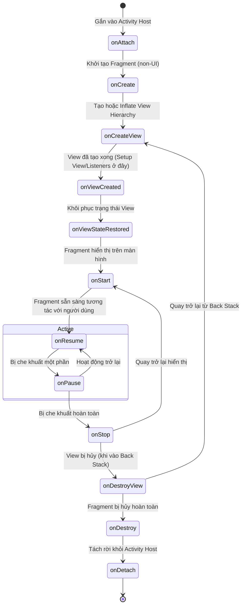

# Chương 7: Thành phần Giao diện Phân đoạn (Fragment)

Fragment đại diện cho một phần hành vi hoặc một phần giao diện người dùng (UI) có thể tái sử dụng được bên trong một `Activity`. Một Activity có thể chứa nhiều Fragment cùng lúc và một Fragment có thể được tái sử dụng trong nhiều Activity khác nhau.

---

## 7.1 Giới thiệu Fragment

### 1. Nguồn gốc & Mục đích Ra đời
- Fragment được giới thiệu từ **Android 3.0 (Honeycomb - API 11)** khi các thiết bị máy tính bảng (Tablet) chạy Android xuất hiện.
- **Vấn đề cốt lõi:** Kích thước màn hình giữa điện thoại (nhỏ) và tablet (lớn) rất khác nhau.
  - Trên điện thoại: Danh sách bài viết nằm ở Màn hình A (Activity A), khi bấm vào sẽ mở Màn hình chi tiết B (Activity B).
  - Trên máy tính bảng: Màn hình đủ rộng để hiển thị song song cả Danh sách (bên trái) và Chi tiết (bên phải) cùng một lúc.
- Fragment đóng vai trò là các khối xếp hình (Modular UI blocks) giúp giải quyết bài toán giao diện đa kích thước một cách linh hoạt:

```mermaid
graph TD
    subgraph Điện thoại (Handset)
        Act1[Activity A: Danh sách] -->|Mở màn hình mới| Act2[Activity B: Chi tiết]
    end

    subgraph Máy tính bảng (Tablet)
        TabletAct[Single Activity]
        TabletAct --> FragList[Fragment 1: Danh sách]
        TabletAct --> FragDetail[Fragment 2: Chi tiết]
    end
```

### 2. Kiến trúc Hiện đại: Single-Activity Architecture (SAA)
Trong phát triển Android hiện đại (với sự hỗ trợ của **Jetpack Navigation Component**):
- Khuyến nghị phổ biến là sử dụng mô hình **Single-Activity Architecture**: Cả ứng dụng chỉ có **duy nhất 1 Activity** (thường là `MainActivity`) đóng vai trò làm khung xương (Host/Container), mọi màn hình tính năng đều được biểu diễn dưới dạng các **Fragment**.
- **Lợi ích:** Tiết kiệm tài nguyên hệ thống, chuyển màn hình mượt mà hơn, chia sẻ dữ liệu qua `Shared ViewModel` vô cùng thuận tiện.

---

## 7.2 Vòng đời của Fragment (Fragment Lifecycle)

Fragment có một vòng đời phức tạp hơn Activity vì nó gắn chặt với vòng đời của Activity chứa nó, đồng thời bản thân UI của Fragment (View) có thể bị hủy và tạo lại nhiều lần trong khi thể hiện (Instance) của Fragment vẫn còn tồn tại.

### 1. Sơ đồ Vòng đời Chi tiết



### 2. Ý nghĩa Chi tiết của các Callbacks

1. **`onAttach(context: Context)`**: Được gọi khi Fragment được gắn vào Host Activity. Bắt đầu có thể truy cập `Context`.
2. **`onCreate(savedInstanceState: Bundle?)`**: Khởi tạo các biến, dữ liệu logic (non-UI). Lúc này View **chưa** được tạo.
3. **`onCreateView(inflater, container, savedInstanceState): View?`**: Phương thức chịu trách nhiệm inflate layout XML thành cây phân cấp `View`.
4. **`onViewCreated(view: View, savedInstanceState: Bundle?)`**: **Nơi quan trọng nhất để khởi tạo logic giao diện**: Lấy các view, gán adapter cho RecyclerView, thiết lập OnClickListener, quan sát LiveData/StateFlow.
5. **`onViewStateRestored(savedInstanceState: Bundle?)`**: Gọi sau khi các view con đã được hệ thống khôi phục trạng thái lưu trữ (ví dụ text trong EditText).
6. **`onStart()`**: Fragment bắt đầu nhìn thấy được trên màn hình.
7. **`onResume()`**: Fragment ở trạng thái hoạt động và nhận tương tác từ người dùng.
8. **`onPause()`**: Người dùng bắt đầu rời khỏi Fragment (ví dụ: mở dialog che khuất, hoặc chuyển tab).
9. **`onStop()`**: Fragment không còn nhìn thấy nữa.
10. **`onDestroyView()`**: Toàn bộ hệ thống View bị hủy giải phóng RAM (ví dụ: khi Fragment bị đưa vào Back Stack). **Lưu ý: Thể hiện Fragment vẫn sống trong bộ nhớ!**
11. **`onDestroy()`**: Thể hiện Fragment bị giải phóng khỏi bộ nhớ.
12. **`onDetach()`**: Fragment hoàn toàn tách khỏi Activity.

### 3. Cạm bẫy Rò rỉ Bộ nhớ: `viewLifecycleOwner` vs `this`

> [!CAUTION]
> **Đây là lỗi phổ biến nhất khi viết Fragment trong Android!**
> Khi Fragment nằm trong Back Stack, hàm `onDestroyView()` được gọi (View bị hủy), nhưng hàm `onDestroy()` chưa được gọi (Fragment instance vẫn sống).
> Nếu bạn observe `LiveData` hoặc lưu biến `ViewBinding` bằng vòng đời của Fragment (`this`):
> 1. Binding sẽ giữ tham chiếu tới View đã chết $\rightarrow$ **Gây Memory Leak**.
> 2. Quan sát LiveData với `this` sẽ kích hoạt callback nhiều lần mỗi khi quay lại màn hình.
>
> **Quy tắc vàng:**
> - Luôn quan sát LiveData/Flow với **`viewLifecycleOwner`**.
> - Phải gán `_binding = null` trong hàm `onDestroyView()`.

```kotlin
class ProductListFragment : Fragment() {

    // Khai báo view binding an toàn tránh memory leak
    private var _binding: FragmentProductListBinding? = null
    private val binding get() = _binding!!

    override fun onCreateView(
        inflater: LayoutInflater,
        container: ViewGroup?,
        savedInstanceState: Bundle?
    ): View {
        _binding = FragmentProductListBinding.inflate(inflater, container, false)
        return binding.root
    }

    override fun onViewCreated(view: View, savedInstanceState: Bundle?) {
        super.onViewCreated(view, savedInstanceState)
        
        // Luôn sử dụng viewLifecycleOwner để observe dữ liệu
        viewModel.products.observe(viewLifecycleOwner) { list ->
            adapter.submitList(list)
        }
    }

    override fun onDestroyView() {
        super.onDestroyView()
        // Giải phóng tham chiếu UI khi view bị hủy
        _binding = null
    }
}
```

---

## 7.3 Thêm Fragment vào Activity

Có 2 cách để gắn Fragment vào một Activity:

### 1. Thêm Tĩnh (Static via XML) - *Ít dùng/Hạn chế*
Khai báo trực tiếp thẻ `<androidx.fragment.app.FragmentContainerView>` hoặc thẻ `<fragment>` trong XML layout của Activity:

```xml
<!-- activity_main.xml -->
<androidx.fragment.app.FragmentContainerView
    android:id="@+id/fragment_news"
    android:name="com.example.NewsFragment"
    android:layout_width="match_parent"
    android:layout_height="match_parent" />
```
*Nhược điểm:* Không thể linh hoạt thay thế (replace), xóa (remove) Fragment trong lúc ứng dụng đang chạy.

### 2. Thêm Động (Dynamic via Code) - *Chuẩn mực*
Sử dụng `FragmentContainerView` làm khung chứa trong XML, sau đó dùng `FragmentManager` để thêm/thay thế Fragment bằng mã Kotlin.

```xml
<!-- activity_main.xml -->
<androidx.fragment.app.FragmentContainerView
    android:id="@+id/fragment_container"
    android:layout_width="match_parent"
    android:layout_height="match_parent" />
```

Trong Kotlin Activity:
```kotlin
class MainActivity : AppCompatActivity() {

    override fun onCreate(savedInstanceState: Bundle?) {
        super.onCreate(savedInstanceState)
        setContentView(R.layout.activity_main)

        // Chỉ thêm ở lần chạy đầu tiên, tránh thêm đè khi xoay màn hình (re-creation)
        if (savedInstanceState == null) {
            supportFragmentManager.beginTransaction()
                .replace(R.id.fragment_container, HomeFragment())
                .commit()
        }
    }
}
```

---

## 7.4 Quản lý Fragment với FragmentManager & FragmentTransaction

### 1. Phân biệt các loại FragmentManager
- **`supportFragmentManager`**: Quản lý các Fragment con trực thuộc Activity.
- **`childFragmentManager`**: Quản lý các Fragment lồng bên trong một Fragment khác (Nested Fragments, ví dụ: các tab bên trong 1 màn hình Fragment).
- **`parentFragmentManager`**: Truy cập ngược lên FragmentManager của cha (Fragment cha hoặc Activity).

### 2. Các thao tác cơ bản trong FragmentTransaction

| Thao tác | Mô tả |
| :--- | :--- |
| `add(containerId, fragment)` | Thêm một Fragment mới chồng lên các View hiện có trong container. |
| `replace(containerId, fragment)` | Xóa (remove) toàn bộ các Fragment đang có trong container rồi thêm Fragment mới vào. |
| `remove(fragment)` | Gỡ bỏ hoàn toàn một Fragment ra khỏi màn hình. |
| `hide(fragment)` / `show(fragment)` | Ẩn/Hiện Fragment mà không hủy View của nó (hữu ích cho mô hình Bottom Navigation 4-5 tabs giữ nguyên trạng thái scroll). |
| `addToBackStack(name)` | Đưa transaction này vào Back Stack. Khi người dùng bấm nút **Back**, hệ thống sẽ hoàn tác (undo) lại thao tác thay vì thoát app. |

### 3. Phân biệt các phương thức `commit()`
- **`commit()`**: Bất đồng bộ (Asynchronous). Đưa transaction vào hàng đợi trên Main Thread, hệ thống sẽ thực thi vào chu kỳ lặp (event loop) kế tiếp. Thường dùng nhất.
- **`commitNow()`**: Đồng bộ (Synchronous). Thực thi ngay lập tức tại dòng code đó. Không được phép dùng chung với `addToBackStack()`.
- **`commitAllowingStateLoss()`**: Cho phép commit sau khi Activity đã gọi `onSaveInstanceState()`. Dùng khi bạn không thể kiểm soát chính xác thời điểm hoàn thành của background task (nhưng cần cẩn trọng vì trạng thái Fragment có thể bị mất nếu hệ thống kill process).

---

## 7.5 Cơ chế Truyền dữ liệu và Giao tiếp giữa các Fragment

> [!IMPORTANT]
> **Quy tắc cốt lõi:** Tuyệt đối **KHÔNG** truyền dữ liệu vào Fragment thông qua Constructor có tham số (ví dụ: `HomeFragment(val userId: String)`).
> Khi hệ điều hành tái tạo lại ứng dụng (xoay màn hình, thiếu RAM), Android chỉ gọi **Constructor mặc định không đối số (Default Empty Constructor)** bằng cơ chế Reflection. Mọi tham số trong constructor tùy biến sẽ bị bỏ qua và dẫn đến Crash!

### 1. Cách 1: Truyền dữ liệu qua `Arguments` (Bundle)
Đây là cách chuẩn mực để truyền dữ liệu khởi tạo vào một Fragment:

```kotlin
class DetailFragment : Fragment() {

    companion object {
        private const val ARG_USER_ID = "arg_user_id"

        // Factory pattern để tạo instance
        fun newInstance(userId: String): DetailFragment {
            val fragment = DetailFragment()
            val args = Bundle().apply {
                putString(ARG_USER_ID, userId)
            }
            fragment.arguments = args
            return fragment
        }
    }

    override fun onViewCreated(view: View, savedInstanceState: Bundle?) {
        super.onViewCreated(view, savedInstanceState)
        val userId = arguments?.getString(ARG_USER_ID) ?: ""
        // Sử dụng userId
    }
}
```

### 2. Cách 2: Fragment Result API (Truyền dữ liệu 1 chiều giữa 2 Fragment)
Từ `androidx.fragment:fragment-ktx:1.3.0+`, Google giới thiệu **Fragment Result API** để truyền kết quả từ Fragment B quay về Fragment A (thay thế cho interface listener cồng kềnh):

```kotlin
// Ở Fragment A (Fragment nhận kết quả):
override fun onCreate(savedInstanceState: Bundle?) {
    super.onCreate(savedInstanceState)
    setFragmentResultListener("requestKey") { requestKey, bundle ->
        val result = bundle.getString("selected_item")
        binding.tvResult.text = result
    }
}

// Ở Fragment B (Fragment con trả kết quả về):
binding.btnConfirm.setOnClickListener {
    val result = bundleOf("selected_item" to "Cơm tấm sườn bì")
    setFragmentResult("requestKey", result)
    // Đóng màn hình hiện tại quay về màn trước
    parentFragmentManager.popBackStack()
}
```

### 3. Cách 3: Shared ViewModel (Giao tiếp trạng thái phức tạp)
Khi hai Fragment trong cùng một Activity cần chia sẻ dữ liệu liên tục (ví dụ: giỏ hàng, thông tin đăng nhập), sử dụng chung một `ViewModel` được gắn phạm vi (Scope) ở Activity:

```kotlin
class SharedViewModel : ViewModel() {
    private val _selectedItem = MutableLiveData<String>()
    val selectedItem: LiveData<String> = _selectedItem

    fun selectItem(item: String) {
        _selectedItem.value = item
    }
}

// Trong Fragment A và Fragment B:
class FragmentA : Fragment() {
    // Sử dụng activityViewModels() của ktx để share chung thể hiện của Activity
    private val sharedViewModel: SharedViewModel by activityViewModels()

    fun onUserClick() {
        sharedViewModel.selectItem("Item 1")
    }
}
```

---

## 7.6 Tóm tắt & Câu hỏi Ôn tập

### Điểm mấu chốt cần nhớ:
1. **Mục đích**: Fragment đại diện cho khối giao diện có thể tái sử dụng, là nền tảng của kiến trúc *Single-Activity Architecture*.
2. **Vòng đời View**: `onDestroyView()` hủy View nhưng Fragment vẫn còn sống trong Back Stack. Phải gán `_binding = null` và dùng `viewLifecycleOwner`.
3. **Truyền tham số**: Phải dùng `Bundle` qua `arguments` hoặc Factory method `newInstance()`, tuyệt đối không dùng Constructor có đối số.
4. **Giao tiếp**: Dùng `Fragment Result API` cho kết quả đơn lẻ hoặc `activityViewModels()` để chia sẻ trạng thái liên tục.

### Câu hỏi Kiểm tra Hiểu biết:
1. **Tại sao hàm `onCreateView()` và `onDestroyView()` trong Fragment lại tách biệt với `onCreate()` và `onDestroy()`?**
   - *Trả lời:* Vì vòng đời View của Fragment có thể sinh ra và hủy nhiều lần trong khi Fragment instance vẫn được lưu trong bộ nhớ (điển hình là khi Fragment bị đưa vào Back Stack). Việc tách biệt giúp Android giải phóng bớt bộ nhớ đồ họa của các View bị che khuất mà không làm mất trạng thái dữ liệu của Fragment.
2. **Sự khác biệt giữa phương thức `add()` và `replace()` trong `FragmentTransaction` là gì?**
   - *Trả lời:* `add()` giữ nguyên các Fragment hiện có trong container và vẽ Fragment mới đè lên trên (View cũ vẫn tồn tại trong View Tree). `replace()` sẽ gỡ bỏ (remove) toàn bộ các Fragment đang có trong container rồi mới thêm Fragment mới vào (View cũ bị hủy).
3. **Điều gì sẽ xảy ra nếu một Fragment dùng Constructor có đối số `MyFragment(val title: String)` khi người dùng xoay ngang màn hình?**
   - *Trả lời:* Ứng dụng sẽ ném ra ngoại lệ `Fragment.InstantiationException` và bị văng (Crash). Nguyên nhân do khi xoay màn hình, Activity bị hủy và tái tạo, Android sẽ cố gắng gọi Default Constructor (không đối số) của Fragment thông qua Reflection, nhưng constructor này không tồn tại hoặc dữ liệu `title` không được phục hồi.
