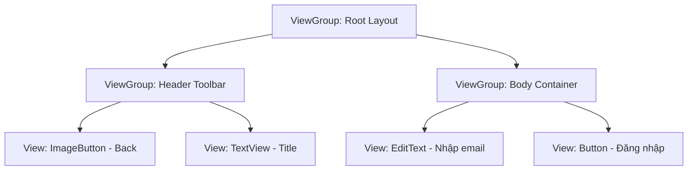
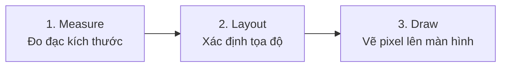
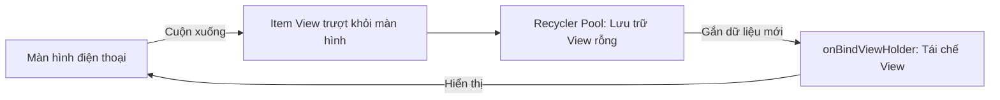
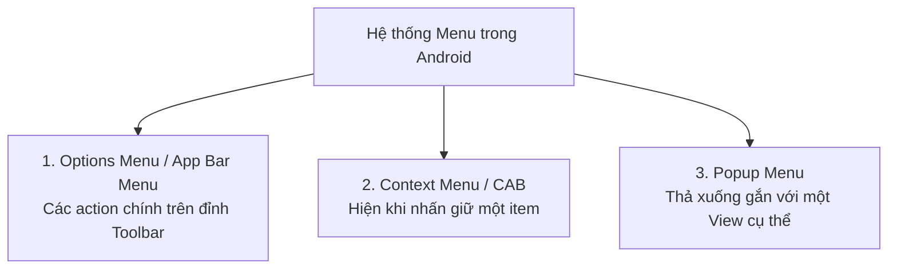

# Chương 8: Lớp Giao diện Người dùng (User Interface Class)

Giao diện người dùng trong Android được xây dựng dựa trên mô hình phân cấp dạng cây (Tree Hierarchy) của các đối tượng `View` và `ViewGroup`. Việc hiểu rõ cơ chế hiển thị, cách tổ chức layout và quản lý sự kiện là yếu tố quyết định để tạo ra ứng dụng mượt mà, trực quan và đạt chuẩn 60fps / 120fps.

---

## 8.1 Kiến trúc Giao diện: View, ViewGroup và Chu trình Vẽ

### 1. View và ViewGroup
- **`View` (Widget)**: Đơn vị xây dựng giao diện cơ bản nhất. Đại diện cho một vùng chữ nhật trên màn hình chịu trách nhiệm vẽ nội dung và xử lý tương tác của người dùng.
  - *Ví dụ:* `TextView`, `Button`, `ImageView`, `EditText`, `CheckBox`.
- **`ViewGroup` (Container/Layout)**: Là một lớp con đặc biệt của `View` có khả năng chứa các `View` hoặc các `ViewGroup` khác bên trong nó.
  - *Ví dụ:* `LinearLayout`, `ConstraintLayout`, `FrameLayout`, `RecyclerView`.



### 2. Chu trình Vẽ View (Rendering Pipeline)
Khi Activity được hiển thị, hệ điều hành Android sẽ duyệt cây View từ đỉnh (Root View) xuống các lá thông qua **3 bước tuần tự**:



1. **Measure Phase (`measure()` $\rightarrow$ `onMeasure()`)**:
   - Hệ thống đo đạc kích thước của từng View.
   - Quá trình diễn ra theo kiểu Top-Down: View cha truyền các ràng buộc kích thước (`MeasureSpec`: `EXACTLY`, `AT_MOST`, `UNSPECIFIED`) xuống các View con để tính toán chiều rộng và chiều cao.
2. **Layout Phase (`layout()` $\rightarrow$ `onLayout()`)**:
   - Xác định tọa độ vị trí 4 cạnh (Left, Top, Right, Bottom) của từng View con trên không gian hiển thị của View cha.
3. **Draw Phase (`draw()` $\rightarrow$ `onDraw()`)**:
   - Chuyển dữ liệu thành các pixel thực tế thông qua đối tượng `Canvas` và `Paint` để đưa lên GPU render ra màn hình.

> [!WARNING]
> **Vấn đề Nested Layouts (Lồng ghép Layout quá sâu):**
> Nếu bạn lồng nhiều cấp `LinearLayout` có thuộc tính `layout_weight` hoặc nhiều `RelativeLayout` vào nhau, hệ thống buộc phải duyệt đệ quy và tính toán Measure nhiều lần (`O(2^n)`). Điều này dẫn đến hiện tượng tụt khung hình (Jank/Frame Drop) làm ứng dụng không đạt chuẩn 60 FPS (mỗi frame chỉ có 16.6ms để hoàn thành).

---

## 8.2 Truy cập View trong Mã nguồn (View Binding)

Lịch sử phát triển cơ chế truy cập View trong Android:
1. `findViewById<T>()` (Legacy): Chậm, dễ gây lỗi `NullPointerException` (nếu ID không tồn tại trong layout) hoặc `ClassCastException` (nếu ép sai kiểu View).
2. `Kotlin Synthetics`: Tiện lợi nhưng không an toàn về phạm vi (scope) và đã bị Google chính thức khai tử.
3. **`View Binding` (Chuẩn mực hiện đại)**: Tự động sinh ra một Binding Class tương ứng với từng tệp layout XML, đảm bảo 100% **Type-safety** và **Null-safety**.

### Cách sử dụng View Binding:
Kích hoạt trong `build.gradle.kts`:
```kotlin
android {
    buildFeatures {
        viewBinding = true
    }
}
```

Sử dụng trong Activity:
```kotlin
class MainActivity : AppCompatActivity() {

    private lateinit var binding: ActivityMainBinding

    override fun onCreate(savedInstanceState: Bundle?) {
        super.onCreate(savedInstanceState)
        // Inflate layout thông qua binding class
        binding = ActivityMainBinding.inflate(layoutInflater)
        setContentView(binding.root)

        // Truy cập view an toàn tuyệt đối
        binding.tvTitle.text = "Xin chào Android"
        binding.btnSubmit.setOnClickListener {
            val name = binding.edtName.text.toString()
            Toast.makeText(this, "Hello $name", Toast.LENGTH_SHORT).show()
        }
    }
}
```

---

## 8.3 Các loại Layout Phổ biến

### 1. `LinearLayout`
Sắp xếp các View con theo một hàng ngang (`horizontal`) hoặc một cột dọc (`vertical`).
- **Thuộc tính quan trọng:**
  - `android:orientation`: `vertical` hoặc `horizontal`.
  - `android:layout_weight`: Phân chia tỷ lệ kích thước còn dư giữa các View con.
  - `android:gravity` (căn chỉnh nội dung bên trong) vs `android:layout_gravity` (căn chỉnh chính View đó so với cha).

### 2. `FrameLayout`
Là ViewGroup đơn giản nhất, thường dùng để chứa **một View con duy nhất** hoặc xếp chồng các View lên nhau theo trục Z (View nào khai báo sau sẽ đè lên View khai báo trước).
- Thường dùng làm khung chứa rỗng để hiển thị `Fragment` hoặc làm lớp phủ mờ loading (Overlay Indicator).

### 3. `ConstraintLayout` (Trọng tâm hiện đại)
`ConstraintLayout` là Layout mạnh mẽ và linh hoạt nhất, được thiết kế để giải quyết bài toán làm phẳng cây giao diện (**Flatten View Hierarchy**), loại bỏ hoàn toàn việc lồng ghép nhiều layout.

```xml
<androidx.constraintlayout.widget.ConstraintLayout 
    xmlns:android="http://schemas.android.com/apk/res/android"
    xmlns:app="http://schemas.android.com/apk/res-auto"
    android:layout_width="match_parent"
    android:layout_height="match_parent">

    <ImageView
        android:id="@+id/imgAvatar"
        android:layout_width="80dp"
        android:layout_height="80dp"
        android:layout_marginStart="16dp"
        android:layout_marginTop="16dp"
        app:layout_constraintStart_toStartOf="parent"
        app:layout_constraintTop_toTopOf="parent" />

    <TextView
        android:id="@+id/tvUserName"
        android:layout_width="0dp"
        android:layout_height="wrap_content"
        android:layout_marginStart="12dp"
        android:layout_marginEnd="16dp"
        android:text="Nguyễn Văn A"
        android:textSize="18sp"
        android:textStyle="bold"
        app:layout_constraintEnd_toEndOf="parent"
        app:layout_constraintStart_toEndOf="@id/imgAvatar"
        app:layout_constraintTop_toTopOf="@id/imgAvatar" />

    <TextView
        android:id="@+id/tvBio"
        android:layout_width="0dp"
        android:layout_height="wrap_content"
        android:text="Android Mobile Developer"
        app:layout_constraintEnd_toEndOf="@id/tvUserName"
        app:layout_constraintStart_toStartOf="@id/tvUserName"
        app:layout_constraintTop_toBottomOf="@id/tvUserName" />

</androidx.constraintlayout.widget.ConstraintLayout>
```

#### Các khái niệm cao cấp trong ConstraintLayout:
- **Constraints (Ràng buộc)**: Mỗi View cần tối thiểu 2 điểm neo (1 ngang: Start/End và 1 dọc: Top/Bottom) để xác định vị trí.
- **`0dp` (`match_constraint`)**: Thay thế cho `match_parent`. View sẽ tự động co giãn vừa vặn với các điểm neo đã chỉ định.
- **Guideline**: Đường kẻ ảo vô hình (căn theo `dp` hoặc `%`) giúp các View căn chỉnh đồng đều trên các kích cỡ màn hình khác nhau.
- **Barrier (Rào chắn)**: Đường ranh giới ảo tự động co giãn theo View có kích thước lớn nhất trong nhóm (rất hữu ích khi làm ứng dụng đa ngôn ngữ có độ dài chuỗi ký tự thay đổi).
- **Chains (Chuỗi liên kết)**: Nhóm các View lại với nhau theo trục ngang hoặc dọc với các chế độ phân phối khoảng cách: `spread`, `spread_inside`, `packed`.

---

## 8.4 Hiển thị Danh sách Tối ưu với RecyclerView

Thay vì sử dụng `ListView` truyền thống (lãng phí bộ nhớ và chậm chạp), chuẩn mực từ lâu của Android là **`RecyclerView`**:
- **Cơ chế tái sử dụng (View Recycling)**: Chỉ tạo số lượng `ViewHolder` vừa đủ để hiển thị trên màn hình. Khi người dùng cuộn (scroll), các View trôi ra khỏi màn hình sẽ được đưa vào hàng đợi (`RecyclerPool`) và gắn dữ liệu mới vào để hiển thị lại thay vì tạo mới (`inflate`) từ đầu.



### Các thành phần chính của RecyclerView:
1. **`RecyclerView.Adapter`**: Cầu nối giữa tập dữ liệu (Data Source) và giao diện.
2. **`RecyclerView.ViewHolder`**: Giữ tham chiếu đến các thành phần View trong một dòng giao diện để tránh gọi lại `findViewById`.
3. **`LayoutManager`**: Quyết định cách bố trí các item:
   - `LinearLayoutManager`: Danh sách cuộn thẳng đứng hoặc nằm ngang.
   - `GridLayoutManager`: Bảng lưới nhiều cột.
   - `StaggeredGridLayoutManager`: Lưới so le kiểu Pinterest.
4. **`DiffUtil` / `ListAdapter`**: Tự động tính toán sự khác biệt giữa hai danh sách dữ liệu cũ và mới trên background thread, sau đó kích hoạt các hiệu ứng hoạt ảnh thêm/sửa/xóa tương ứng mượt mà.

---

## 8.5 Menu và Toolbar

### 1. Phân biệt ActionBar và Toolbar
- **`ActionBar` (Legacy)**: Thanh tiêu đề mặc định gắn cứng trên đỉnh cửa sổ do hệ thống quản lý, rất khó tùy biến giao diện và hiệu ứng.
- **`Toolbar` (Hiện đại)**: Là một `ViewGroup` độc lập có thể đặt ở bất kỳ đâu trong layout (thậm chí có thể đặt nhiều Toolbar trong cùng một màn hình). Để sử dụng, ta đặt theme thành `Theme.MaterialComponents.DayNight.NoActionBar` và thiết lập:
```kotlin
setSupportActionBar(binding.toolbar)
```

### 2. Các loại Menu trong Android



#### Sử dụng Menu với `MenuProvider` (Chuẩn Jetpack mới thay thế `onCreateOptionsMenu`):
```kotlin
class HomeFragment : Fragment() {

    override fun onViewCreated(view: View, savedInstanceState: Bundle?) {
        super.onViewCreated(view, savedInstanceState)

        val menuHost: MenuHost = requireActivity()
        menuHost.addMenuProvider(object : MenuProvider {
            override fun onCreateMenu(menu: Menu, menuInflater: MenuInflater) {
                menuInflater.inflate(R.menu.menu_home, menu)
            }

            override fun onMenuItemSelected(menuItem: MenuItem): Boolean {
                return when (menuItem.itemId) {
                    R.id.action_search -> {
                        // Xử lý tìm kiếm
                        true
                    }
                    R.id.action_settings -> {
                        // Mở cài đặt
                        true
                    }
                    else -> false
                }
            }
        }, viewLifecycleOwner, Lifecycle.State.RESUMED)
    }
}
```

---

## 8.6 Hộp thoại Tương tác (Dialogs)

### 1. Các loại Dialog
- **`AlertDialog`**: Dùng để hiển thị thông báo khẩn, cảnh báo, xác nhận hành động (Yes/No), hoặc danh sách lựa chọn.
- **Specialized Pickers**: `DatePickerDialog`, `TimePickerDialog`.
- **`BottomSheetDialog`**: Hộp thoại vuốt trượt từ dưới đáy màn hình lên (rất phổ biến trong ứng dụng hiện đại).

### 2. Sử dụng `DialogFragment` để Tránh Memory Leak
> [!IMPORTANT]
> **Tại sao không nên gọi trực tiếp `AlertDialog.Builder(this).show()` trong Activity?**
> Nếu Activity bị xoay ngang màn hình trong lúc Dialog đang mở, Activity cũ sẽ bị hủy nhưng Dialog vẫn cố níu giữ tham chiếu đến Window của Activity cũ $\rightarrow$ Ứng dụng sẽ bị văng (Crash) với lỗi kinh điển `WindowManager$BadTokenException: Unable to add window -- token is not valid`.
>
> **Giải pháp chuẩn:** Luôn bọc Dialog bên trong một lớp **`DialogFragment`**. `DialogFragment` là một Fragment chuẩn, có vòng đời đầy đủ và được `FragmentManager` tự động khôi phục an toàn qua quá trình xoay màn hình.

```kotlin
class ConfirmDeleteDialogFragment : DialogFragment() {

    override fun onCreateDialog(savedInstanceState: Bundle?): Dialog {
        return AlertDialog.Builder(requireContext())
            .setTitle("Xác nhận xóa")
            .setMessage("Bạn có chắc chắn muốn xóa bản ghi này?")
            .setPositiveButton("Xóa") { _, _ ->
                // Thông báo kết quả cho Fragment cha qua Fragment Result API
                setFragmentResult("delete_request", bundleOf("confirmed" to true))
            }
            .setNegativeButton("Hủy", null)
            .create()
    }
}

// Cách mở từ Fragment cha:
ConfirmDeleteDialogFragment().show(parentFragmentManager, "ConfirmDeleteDialog")
```

---

## 8.7 Tóm tắt & Câu hỏi Ôn tập

### Điểm mấu chốt cần nhớ:
1. **Chu trình vẽ**: `Measure` $\rightarrow$ `Layout` $\rightarrow$ `Draw`. Tránh lồng ghép layout sâu gây drop frame.
2. **View Binding**: Chuẩn mực thay thế `findViewById` an toàn 100% về type và nullability.
3. **ConstraintLayout**: Công cụ số 1 để xây dựng giao diện phức tạp với cấu trúc phẳng.
4. **RecyclerView**: Tái sử dụng View thông qua ViewHolder pattern; dùng kết hợp `ListAdapter` & `DiffUtil`.
5. **DialogFragment**: Tránh lỗi `BadTokenException` khi xoay màn hình so với `AlertDialog` thông thường.

### Câu hỏi Kiểm tra Hiểu biết:
1. **Tại sao `ConstraintLayout` lại giúp ứng dụng chạy mượt mà hơn so với việc lồng nhiều `LinearLayout`?**
   - *Trả lời:* Vì `ConstraintLayout` duy trì cấu trúc cây phân cấp phẳng (chỉ có 1 cấp cha chứa tất cả các con), hệ thống chỉ cần 1 lượt duyệt đo đạc (`Measure`) và định vị (`Layout`) thay vì phải đệ quy tính toán nhiều lượt lồng nhau như các ViewGroup truyền thống.
2. **Cơ chế tái chế của `RecyclerView` hoạt động như thế nào khi người dùng cuộn danh sách?**
   - *Trả lời:* Khi một item bị cuộn ra khỏi màn hình, view của nó không bị hủy (destroy) mà được đưa vào `RecyclerPool`. Khi một item mới chuẩn bị xuất hiện ở đáy màn hình, hệ thống sẽ lấy View cũ ra, gọi `onBindViewHolder()` để điền dữ liệu mới vào và hiển thị lên, giúp tiết kiệm bộ nhớ RAM và CPU tối đa.
3. **Sự khác biệt giữa `android:layout_gravity` và `android:gravity` là gì?**
   - *Trả lời:* `android:gravity` điều khiển vị trí nội dung bên trong chính View đó (ví dụ: chữ nằm giữa một Button). Trong khi đó, `android:layout_gravity` điều khiển vị trí của chính View đó so với ViewGroup cha chứa nó (ví dụ: View nằm ở góc phải của LinearLayout cha).
