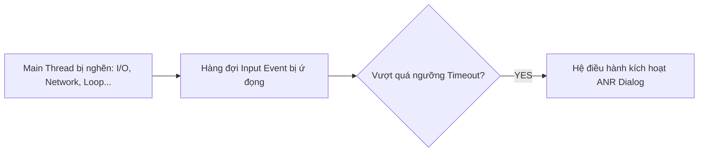
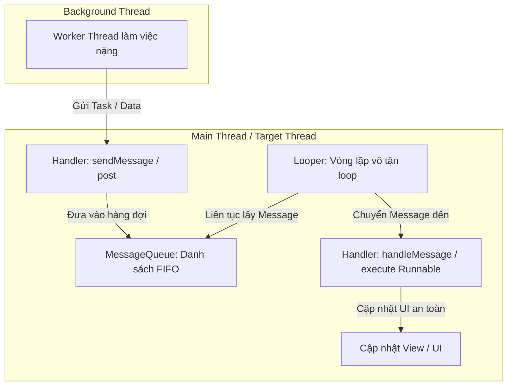
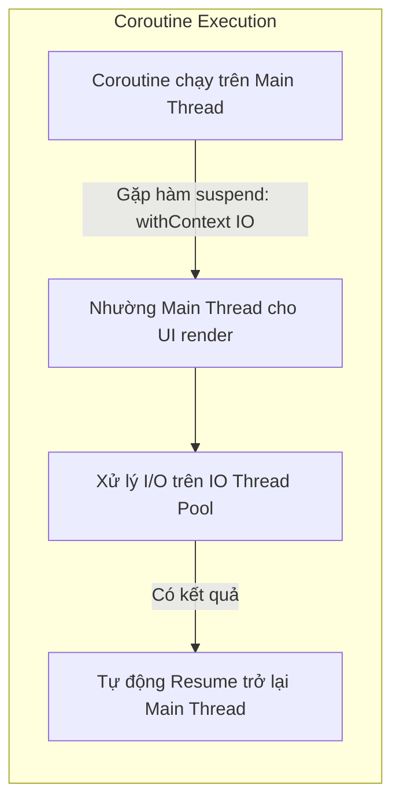

# Chương 9: Đa tuyến trong Android (Multi-Threading)

Trong hệ điều hành Android, việc xử lý tác vụ đồng thời và quản lý luồng (Multi-threading) là kỹ năng quan trọng nhất để giữ cho ứng dụng luôn mượt mà, phản hồi tức thì và không bao giờ bị đóng băng giao diện.

---

## 9.1 Mô hình Đơn luồng & Nguy cơ ANR

### 1. Main Thread (UI Thread)
Khi ứng dụng Android khởi chạy, hệ thống Linux tạo một tiến trình mới với một luồng thực thi duy nhất gọi là **Main Thread** (hay **UI Thread**).
- **Trách nhiệm của Main Thread:**
  - Lắng nghe và điều phối các sự kiện từ người dùng (chạm, vuốt, gõ phím).
  - Tính toán và vẽ giao diện (Measure, Layout, Draw) ở tần số 60Hz hoặc 120Hz (tương ứng với 16.6ms hoặc 8.3ms cho mỗi khung hình).
  - Điều phối vòng đời của các thành phần (Activity, Service, BroadcastReceiver).

### 2. Hai Quy tắc Vàng của Android Threading
> [!IMPORTANT]
> **Quy tắc 1: KHÔNG ĐƯỢC PHÉP làm nghẽn (Block) Main Thread.**
> Mọi tác vụ tốn thời gian (truy vấn Database, đọc/ghi file từ Disk, gọi API mạng, giải nén dữ liệu nặng) **bắt buộc** phải được chuyển sang **Background Thread (Worker Thread)**.
>
> **Quy tắc 2: KHÔNG ĐƯỢC PHÉP chạm vào UI Toolkit từ bên ngoài Main Thread.**
> Hệ thống View của Android không phải là Thread-safe. Nếu cố gắng cập nhật View từ Background Thread, hệ thống sẽ ném ngoại lệ:
> `android.view.ViewRootImpl$CalledFromWrongThreadException: Only the original thread that created a view hierarchy can touch its views.`

### 3. Lỗi ANR (Application Not Responding)
Nếu Main Thread bị chiếm dụng quá lâu và không thể xử lý kịp các sự kiện tiếp theo, hệ điều hành sẽ coi ứng dụng là đã bị đóng băng và hiển thị hộp thoại cảnh báo **ANR (Application Not Responding)** cho phép người dùng buộc dừng ứng dụng.



**Các ngưỡng thời gian kích hoạt ANR:**
- **Input Event (Touch, Key):** Sau **5 giây** không phản hồi.
- **BroadcastReceiver:** Hàm `onReceive()` chạy quá **10 giây** (trên Foreground) hoặc lâu hơn trên Background.
- **Service:** Xử lý tác vụ quá **20 giây** (Foreground Service) hoặc **200 giây** (Background Service).
- *Vết log ANR:* Được lưu tại `/data/anr/traces.txt` để lập trình viên phân tích Call Stack.

---

## 9.2 Cơ chế Cốt lõi: Looper, MessageQueue và Handler

Để hiểu cách Android giao tiếp giữa Worker Thread và Main Thread, bạn cần nắm vững bộ ba nền tảng: **`Handler`**, **`Looper`**, và **`MessageQueue`**.



### 1. Vai trò của từng thành phần
- **`MessageQueue`**: Hàng đợi lưu trữ danh sách các thông điệp (`Message`) hoặc đoạn mã (`Runnable`) cần được thực thi, sắp xếp theo thứ tự thời gian (FIFO).
- **`Looper`**: Một vòng lặp vô tận gắn liền với luồng (`Looper.loop()`). Nhiệm vụ của nó là liên tục rút từng `Message` ra khỏi `MessageQueue` và chuyển cho `Handler` tương ứng xử lý.
  - Mặc định, **chỉ có Main Thread** là có sẵn `Looper`.
  - Các Worker Thread thông thường không có `Looper` (trừ khi dùng `HandlerThread` hoặc tự gọi `Looper.prepare()` và `Looper.loop()`).
- **`Handler`**: Cầu nối hai đầu:
  1. **Phía gửi:** Cho phép các luồng khác gửi tin nhắn (`sendMessage()`) hoặc đẩy công việc (`post(Runnable)`) vào `MessageQueue`.
  2. **Phía nhận:** Xử lý nội dung của tin nhắn trên chính luồng mà `Handler` đó được khởi tạo (`handleMessage()`).

### 2. Ví dụ sử dụng Handler truyền thống:
```kotlin
// Khởi tạo Handler gắn với Main Looper
val mainHandler = Handler(Looper.getMainLooper())

// Chạy tác vụ nền bằng Thread thuần
Thread {
    // 1. Chạy trên Background Thread
    val result = performHeavyDownload()

    // 2. Chuyển kết quả về Main Thread để cập nhật UI
    mainHandler.post {
        binding.tvStatus.text = "Tải thành công: $result"
    }
}.start()
```

---

## 9.3 Lớp `AsyncTask` (Lịch sử & Lý do bị Deprecated)

Trước Android 11, `AsyncTask` từng là lớp tiện ích phổ biến nhất để thực thi tác vụ nền và đẩy kết quả lên UI mà không cần quản lý luồng thủ công.

### 1. Vòng đời của `AsyncTask`
Một `AsyncTask<Params, Progress, Result>` gồm 4 bước:
1. `onPreExecute()`: Chạy trên **Main Thread** trước khi bắt đầu (ví dụ: hiển thị ProgressBar).
2. `doInBackground(vararg params)`: Chạy trên **Background Thread** để thực thi tính toán nặng. Có thể gọi `publishProgress()`.
3. `onProgressUpdate(vararg progress)`: Chạy trên **Main Thread** để cập nhật thanh tiến trình.
4. `onPostExecute(result)`: Chạy trên **Main Thread** khi hoàn tất để hiển thị kết quả lên View.

### 2. Tại sao `AsyncTask` bị Deprecated từ Android 11 (API 30)?
> [!CAUTION]
> Mặc dù đề cương thi có thể vẫn hỏi lý thuyết về `AsyncTask`, trong thực tế nó đã bị Google cấm dùng vì 4 nhược điểm chết người:
>
> 1. **Rò rỉ Bộ nhớ (Memory Leak)**: `AsyncTask` thường được viết dưới dạng một Inner Class bên trong `Activity`. Inner Class này ngầm giữ một tham chiếu mạnh (Implicit Strong Reference) đến Activity cha. Nếu người dùng xoay màn hình (Activity cũ bị hủy và tạo mới), `AsyncTask` vẫn tiếp tục chạy và giữ chặt Activity cũ trong RAM $\rightarrow$ Garbage Collector không thể giải phóng $\rightarrow$ Leak hàng chục MB bộ nhớ.
> 2. **Gây Crash khi Activity đã chết**: Khi task hoàn thành và gọi `onPostExecute()`, nếu Activity đã bị đóng, việc truy cập vào View sẽ gây ra lỗi `NullPointerException` hoặc cập nhật vào giao diện "ma" không còn hiển thị.
> 3. **Chạy Tuần tự (Serial Execution)**: Từ Android 3.0, `AsyncTask` mặc định chạy trên một ThreadPool tuần tự (`SERIAL_EXECUTOR`). Một task bị treo hoặc chạy lâu sẽ chặn đứng toàn bộ các `AsyncTask` khác của ứng dụng.
> 4. **Hủy Task không triệt để**: Hàm `cancel(true)` không ngắt luồng ngay lập tức mà chỉ đặt cờ `isCancelled() = true`. Nếu lập trình viên không chủ động kiểm tra cờ này trong vòng lặp `doInBackground`, task vẫn sẽ âm thầm chạy tiếp.

---

## 9.4 Giải pháp Hiện đại: Kotlin Coroutines

Hiện nay, **Kotlin Coroutines** là chuẩn mực chính thức được Google khuyến nghị cho toàn bộ hệ sinh thái Android.

### 1. Khái niệm Coroutine
- **Luồng nhẹ (Lightweight Threads)**: Một luồng hệ điều hành (OS Thread) tiêu tốn khoảng 1MB RAM để tạo stack. Trong khi đó, hàng trăm nghìn Coroutines có thể chạy đồng thời trên cùng một luồng OS mà chỉ tốn vài chục bytes.
- **Cơ chế Tạm ngừng (Suspending)**: Khi một Coroutine chờ dữ liệu mạng hoặc Disk I/O, nó sẽ **tạm ngừng (suspend)** và nhường luồng đó cho các tác vụ khác xử lý, không bao giờ làm block luồng. Khi có dữ liệu, nó sẽ khôi phục lại (resume) tiếp tục chạy.



### 2. Các thành phần chính trong Coroutines
- **Dispatchers (Bộ điều phối luồng)**:
  - `Dispatchers.Main`: Chạy trên UI Thread (dùng để update View).
  - `Dispatchers.IO`: Tối ưu hóa cho các thao tác vào/ra (Network, Room Database, File I/O).
  - `Dispatchers.Default`: Tối ưu cho các phép tính toán CPU nặng (Parsing JSON lớn, xử lý ảnh, sắp xếp danh sách lớn).
- **Coroutine Builders**:
  - `launch`: Bắn và quên (Fire-and-forget), trả về một `Job`.
  - `async`: Trả về kết quả sau này thông qua `Deferred<T>` với hàm `await()`.
- **Lifecycle-aware Scopes (Phạm vi tự hủy theo vòng đời)**:
  - `lifecycleScope`: Gắn liền với Activity hoặc Fragment. Khi màn hình bị `onDestroy()`, toàn bộ Coroutine bên trong nó sẽ **tự động bị hủy**, giải quyết triệt để vấn đề Memory Leak của `AsyncTask`.
  - `viewModelScope`: Gắn liền với vòng đời của `ViewModel`.

### 3. Ví dụ Viết mã với Coroutines (So sánh trực tiếp):

```kotlin
class ProductViewModel(private val repository: ProductRepository) : ViewModel() {

    private val _uiState = MutableStateFlow<UiState>(UiState.Loading)
    val uiState: StateFlow<UiState> = _uiState.asStateFlow()

    fun loadProductData(productId: String) {
        // Chạy Coroutine an toàn trong phạm vi của ViewModel
        viewModelScope.launch {
            _uiState.value = UiState.Loading
            try {
                // Tự động chuyển sang Dispatchers.IO để lấy dữ liệu mạng
                val product = withContext(Dispatchers.IO) {
                    repository.fetchProductDetails(productId)
                }
                // Tự động quay lại Main Thread để cập nhật UI State
                _uiState.value = UiState.Success(product)
            } catch (e: Exception) {
                _uiState.value = UiState.Error(e.message ?: "Có lỗi xảy ra")
            }
        }
    }
}
```

---

## 9.5 Bảng So sánh Tổng hợp các Giải pháp

| Tiêu chí | `Handler / Looper` | `AsyncTask` (Deprecated) | `RxJava` | `Kotlin Coroutines` (Khuyên dùng) |
| :--- | :--- | :--- | :--- | :--- |
| **Bản chất** | Nền tảng mức thấp của Android OS | Lớp trừu tượng bọc ThreadPool + Handler | Thư viện Lập trình phản ứng (Reactive) | Ngôn ngữ cấp cao + Suspending mechanism |
| **Độ phức tạp** | Khá cao, nhiều boilerplate | Trung bình, dễ dùng nhưng rủi ro | Rất cao, đường cong học tập dốc | Thấp đến trung bình, cú pháp đồng bộ tuần tự |
| **Memory Leak** | Dễ rò rỉ nếu dùng Non-static Handler | Rất dễ rò rỉ khi xoay màn hình | Cần quản lý qua `CompositeDisposable` | Tự động hủy theo `lifecycleScope` / `viewModelScope` |
| **Hiệu năng** | Tốt | Kém khi chạy song song | Cực tốt | Cực tốt, siêu nhẹ (Lightweight) |
| **Khuyến nghị hiện tại** | Dùng cho nội bộ Framework | **Tuyệt đối không dùng trong dự án mới** | Tốt nếu dự án cũ đã dùng sẵn | **Tiêu chuẩn vàng bắt buộc cho Android** |

---

## 9.6 Tóm tắt & Câu hỏi Ôn tập

### Điểm mấu chốt cần nhớ:
1. **Main Thread**: Phụ trách render và xử lý sự kiện UI; tuyệt đối không chạy tác vụ nghẽn quá 16ms.
2. **Nguyên nhân ANR**: Block Main Thread quá 5 giây (input event) hoặc 10 giây (BroadcastReceiver).
3. **Looper/MessageQueue/Handler**: Kiến trúc nền tảng của hệ điều hành để điều phối tin nhắn giữa các luồng.
4. **Tại sao AsyncTask bị khai tử**: Memory Leak, Crash khi Activity bị destroy, và cơ chế hủy lỏng lẻo.
5. **Kotlin Coroutines**: Giải pháp hiện đại, cú pháp non-blocking viết như đồng bộ, tự động hủy an toàn theo vòng đời (`viewModelScope`).

### Câu hỏi Kiểm tra Hiểu biết:
1. **Một sinh viên thực hiện đoạn mã tải ảnh từ Internet ngay trong hàm `onCreate()` của Activity. Chuyện gì sẽ xảy ra?**
   - *Trả lời:* Ứng dụng sẽ ném ra ngoại lệ `android.os.NetworkOnMainThreadException` và Crash ngay lập tức. Hệ điều hành Android (từ Honeycomb 3.0) đã chủ động chặn đứng mọi thao tác truy cập Network trên Main Thread để ngăn ngừa hiện tượng ANR.
2. **Cơ chế vòng đời `viewModelScope` trong Kotlin Coroutines giúp giải quyết vấn đề gì của `AsyncTask`?**
   - *Trả lời:* `viewModelScope` gắn chặt với vòng đời của `ViewModel`. Khi Activity bị xoay màn hình, `ViewModel` không bị hủy, tác vụ mạng tiếp tục chạy bình thường. Khi màn hình thực sự đóng vĩnh viễn (`onCleared()`), `viewModelScope` tự động phát lệnh `cancel` toàn bộ các coroutine đang chạy, ngăn ngừa hoàn toàn rò rỉ bộ nhớ (Memory Leak) và lỗi Crash do cập nhật View chết.
3. **Sự khác biệt giữa `Dispatchers.IO` và `Dispatchers.Default` trong Kotlin Coroutines là gì?**
   - *Trả lời:* `Dispatchers.IO` được phân bổ ThreadPool co giãn (lên tới 64 threads) tối ưu cho các tác vụ nghẽn do chờ đợi bên ngoài (Block I/O như Network, Disk). Trong khi đó, `Dispatchers.Default` được giới hạn số lượng threads tương đương với số nhân CPU của thiết bị, tối ưu hóa cho các tác vụ tính toán nặng ngốn CPU (Parsing dữ liệu, thuật toán sắp xếp).
