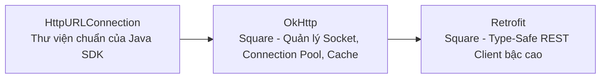
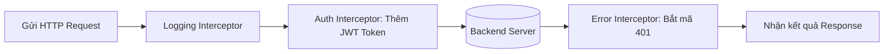
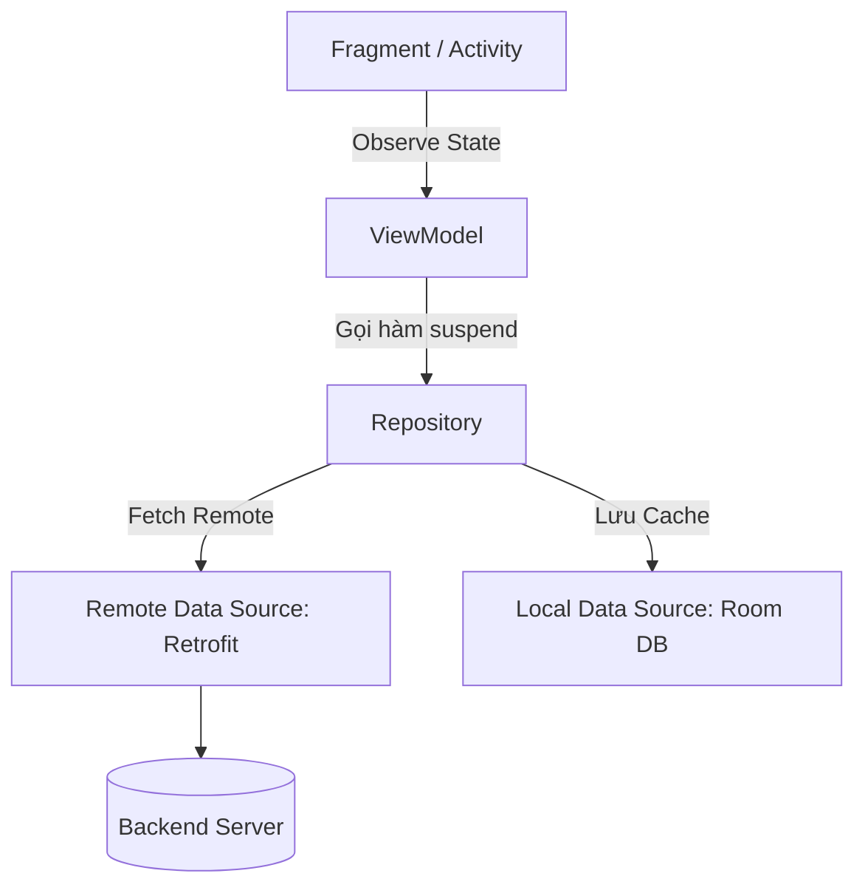

# Chương 10: Kết nối Mạng trong Android (Android Networking)

Giao tiếp mạng là tính năng không thể thiếu của phần lớn các ứng dụng di động hiện đại. Chương này trang bị kiến thức nền tảng về giao thức HTTP/HTTPS, các quy định bảo mật của Android, các thư viện mạng chuẩn công nghiệp (`OkHttp`, `Retrofit`) và các cơ chế xử lý dữ liệu JSON/XML.

---

## 10.1 Tổng quan về Kết nối Mạng trong Android

### 1. Khai báo Quyền trong `AndroidManifest.xml`
Bất kỳ ứng dụng nào muốn kết nối Internet hoặc kiểm tra trạng thái mạng đều bắt buộc phải khai báo các quyền thuộc nhóm **Normal Permission** sau:

```xml
<manifest xmlns:android="http://schemas.android.com/apk/res/android"
    package="com.example.myapp">

    <!-- Bắt buộc để gửi/nhận dữ liệu qua Internet -->
    <uses-permission android:name="android.permission.INTERNET" />

    <!-- Cho phép kiểm tra trạng thái kết nối (Wifi, 4G/5G, Mất mạng) -->
    <uses-permission android:name="android.permission.ACCESS_NETWORK_STATE" />

    <application ...>
    </application>
</manifest>
```

### 2. Quy tắc `NetworkOnMainThreadException`
Từ phiên bản **Android 3.0 (Honeycomb)**, hệ điều hành Android áp dụng chính sách StrictMode:
- Bất kỳ lời gọi hàm mạng nào (mở Socket, gửi HTTP request) được thực thi trên **Main Thread (UI Thread)** sẽ lập tức bị hệ thống ném ngoại lệ:
  `android.os.NetworkOnMainThreadException` và làm ứng dụng văng ngay lập tức.
- **Mục đích:** Ngăn ngừa hiện tượng ứng dụng bị đóng băng (Freeze UI) và lỗi ANR do độ trễ mạng gây ra.

### 3. Chính sách An toàn Mạng (Network Security Config) & Chặn Cleartext HTTP
Bắt đầu từ **Android 9.0 (Pie - API 28)**, Android mặc định **chặn hoàn toàn lưu lượng HTTP không mã hóa (Cleartext Traffic)** để bảo vệ người dùng khỏi các cuộc tấn công nghe lén (Man-in-the-Middle). Tất cả các URL phải dùng giao thức `https://`.

Nếu trong quá trình phát triển (Development), backend nội bộ chỉ chạy HTTP thông thường (ví dụ: `http://192.168.1.100:8080`), bạn có 2 cách xử lý:
- *Cách 1 (Tạm thời - Kém an toàn):* Bật cờ `android:usesCleartextTraffic="true"` trong thẻ `<application>` của Manifest.
- *Cách 2 (Chuẩn mực công nghiệp):* Khai báo tệp `res/xml/network_security_config.xml`:

```xml
<!-- res/xml/network_security_config.xml -->
<?xml version="1.0" encoding="utf-8"?>
<network-security-config>
    <domain-config cleartextTrafficPermitted="true">
        <!-- Chỉ cho phép cleartext với IP local của server dev -->
        <domain includeSubdomains="true">10.0.2.2</domain>
        <domain includeSubdomains="true">192.168.1.100</domain>
    </domain-config>
</network-security-config>
```
Sau đó liên kết vào Manifest: `android:networkSecurityConfig="@xml/network_security_config"`.

---

## 10.2 Tiến hóa các Thư viện Kết nối Mạng



### 1. `HttpURLConnection` (Thư viện gốc của Java/Android)
Là lớp nằm sẵn trong Android SDK (`java.net.HttpURLConnection`).
- **Ưu điểm:** Không cần cài thêm bất kỳ thư viện bên thứ ba nào.
- **Nhược điểm lớn:**
  - Tốn quá nhiều code mẫu (Boilerplate): Phải tự quản lý `InputStream`, `OutputStream`, đọc luồng byte, chuyển chuỗi ký tự, đóng luồng thủ công (`try-finally`).
  - Không hỗ trợ tự động Connection Pooling, Caching, nén Gzip.
  - Rất phức tạp khi xử lý upload file nhiều phần (`multipart/form-data`).

### 2. `OkHttp` (Thư viện tầng Transport của Square)
`OkHttp` là thư viện HTTP Client mạnh mẽ và là nền tảng mà chính bản thân Android SDK sử dụng bên dưới lớp vỏ `HttpURLConnection`.
- **Tính năng nổi bật:**
  - Tự động duy trì Connection Pooling để tái sử dụng kết nối Socket (giảm độ trễ bắt tay TCP/TLS).
  - Tự động nén và giải nén GZIP dữ liệu truyền tải.
  - Hỗ trợ HTTP/2 và WebSocket song công (Full-duplex).
  - Cơ chế **Interceptors (Bộ lọc can thiệp request/response)**:



#### Ví dụ tạo Auth Interceptor với OkHttp:
```kotlin
val authInterceptor = Interceptor { chain ->
    val originalRequest = chain.request()
    // Tự động gán Header Authorization chứa token vào mọi request
    val newRequest = originalRequest.newBuilder()
        .header("Authorization", "Bearer ${TokenManager.getToken()}")
        .header("Accept", "application/json")
        .build()
    chain.proceed(newRequest)
}

val okHttpClient = OkHttpClient.Builder()
    .addInterceptor(authInterceptor)
    .addInterceptor(HttpLoggingInterceptor().apply {
        level = HttpLoggingInterceptor.Level.BODY
    })
    .connectTimeout(30, TimeUnit.SECONDS)
    .readTimeout(30, TimeUnit.SECONDS)
    .build()
```

---

## 10.3 Chuẩn mực Hiện đại: Thư viện Retrofit 2

**`Retrofit`** biến đổi các REST API thành các **Kotlin Interface** an toàn kiểu (Type-safe), tự động phân tích cú pháp (Serialization) và tích hợp hoàn hảo với **Kotlin Coroutines**.

### 1. Khai báo API Service bằng Interface
```kotlin
interface ApiService {

    // 1. GET request đơn giản
    @GET("api/v1/products")
    suspend fun getProducts(
        @Query("category") category: String,
        @Query("page") page: Int = 1
    ): List<ProductDto>

    // 2. GET với Path parameter
    @GET("api/v1/products/{id}")
    suspend fun getProductDetail(
        @Path("id") productId: String
    ): ProductDto

    // 3. POST request với Request Body dạng JSON
    @POST("api/v1/auth/login")
    suspend fun login(
        @Body request: LoginRequest
    ): Response<AuthResponse>

    // 4. Multipart upload file ảnh
    @Multipart
    @POST("api/v1/user/avatar")
    suspend fun uploadAvatar(
        @Part avatar: MultipartBody.Part
    ): BaseResponse
}
```

### 2. Khởi tạo thể hiện Retrofit
```kotlin
object NetworkModule {

    private const val BASE_URL = "https://api.example.com/"

    val apiService: ApiService by lazy {
        Retrofit.Builder()
            .baseUrl(BASE_URL)
            .client(okHttpClient) // Gắn OkHttpClient đã cấu hình ở trên
            .addConverterFactory(GsonConverterFactory.create()) // Hoặc MoshiConverterFactory
            .build()
            .create(ApiService::class.java)
    }
}
```

---

## 10.4 Xử lý Dữ liệu JSON & XML (Data Parsing)

### 1. So sánh các thư viện JSON Parser phổ biến

| Tiêu chí | `org.json` (SDK) | `Gson` (Google) | `Moshi` (Square) | `kotlinx.serialization` (Jetpack) |
| :--- | :--- | :--- | :--- | :--- |
| **Cách tiếp cận** | Thủ công (Imperative) | Reflection | Reflection hoặc CodeGen | Code Generation (Compile-time) |
| **Hỗ trợ Kotlin** | Kém | Trung bình (Không tôn trọng giá trị mặc định và non-nullable của Kotlin) | Rất tốt (Thiết kế riêng cho Kotlin & Java) | Xuất sắc (Thư viện chuẩn của Kotlin Multiplatform) |
| **Hiệu năng** | Phụ thuộc code tay | Chậm do dùng Java Reflection | Rất nhanh khi bật `kapt/ksp` codegen | Cực nhanh (Không dùng reflection lúc runtime) |

### 2. Định nghĩa Data Model với Moshi / Kotlinx.Serialization
```kotlin
// Sử dụng Moshi với Annotation Codegen
@JsonClass(generateAdapter = true)
data class ProductDto(
    @Json(name = "product_id")
    val id: String,

    @Json(name = "name")
    val title: String,

    @Json(name = "price")
    val price: Double,

    @Json(name = "description")
    val description: String? = null // Nullable nếu server có thể trả về null
)
```

---

## 10.5 Kiến trúc Tầng Mạng Chuẩn Mực (Clean Architecture + Repository)

Để ứng dụng dễ viết Unit Test và bảo trì lâu dài, tầng mạng cần được đóng gói qua mô hình **Repository Pattern**:



### 1. Bọc trạng thái kết quả với Sealed Class (`NetworkResult`)
```kotlin
sealed class NetworkResult<out T> {
    data class Success<out T>(val data: T) : NetworkResult<T>()
    data class Error(val message: String, val code: Int? = null) : NetworkResult<Nothing>()
    object Loading : NetworkResult<Nothing>()
}
```

### 2. Triển khai Repository an toàn:
```kotlin
class ProductRepository(private val apiService: ApiService) {

    suspend fun fetchProducts(): NetworkResult<List<ProductDto>> {
        return withContext(Dispatchers.IO) {
            try {
                val response = apiService.getProducts(category = "electronics")
                NetworkResult.Success(response)
            } catch (e: HttpException) {
                // Lỗi HTTP từ server (400, 404, 500)
                NetworkResult.Error("Lỗi máy chủ (${e.code()}): ${e.message()}", e.code())
            } catch (e: IOException) {
                // Lỗi không có mạng, timeout kết nối
                NetworkResult.Error("Không thể kết nối đến máy chủ. Vui lòng kiểm tra Internet!")
            } catch (e: Exception) {
                NetworkResult.Error("Lỗi không xác định: ${e.localizedMessage}")
            }
        }
    }
}
```

---

## 10.6 Giám sát Trạng thái Mạng Thời gian thực (Network Monitoring)

> [!NOTE]
> Việc dùng `BroadcastReceiver` lắng nghe action `CONNECTIVITY_ACTION` đã bị **Deprecated** từ Android 7.0 vì gây tốn pin hệ thống.
> Cách chuẩn hiện đại là đăng ký callback với **`ConnectivityManager`**:

```kotlin
class NetworkMonitor(context: Context) {

    private val connectivityManager = 
        context.getSystemService(Context.CONNECTIVITY_SERVICE) as ConnectivityManager

    fun registerNetworkCallback(onNetworkAvailable: () -> Unit, onNetworkLost: () -> Unit) {
        val request = NetworkRequest.Builder()
            .addCapability(NetworkCapabilities.NET_CAPABILITY_INTERNET)
            .build()

        connectivityManager.registerNetworkCallback(request, object : ConnectivityManager.NetworkCallback() {
            override fun onAvailable(network: Network) {
                // Có kết nối Internet
                onNetworkAvailable()
            }

            override fun onLost(network: Network) {
                // Bị mất kết nối Internet
                onNetworkLost()
            }
        })
    }
}
```

---

## 10.7 Tóm tắt & Câu hỏi Ôn tập

### Điểm mấu chốt cần nhớ:
1. **Quyền bắt buộc**: Khai báo `INTERNET` và `ACCESS_NETWORK_STATE` trong Manifest.
2. **Nguyên tắc vàng**: Tuyệt đối không gọi network trên Main Thread (`NetworkOnMainThreadException`).
3. **Bảo mật**: Mặc định Android chặn Cleartext HTTP; phải dùng HTTPS hoặc cấu hình `network_security_config.xml`.
4. **Bộ đôi OkHttp & Retrofit**: OkHttp quản lý tầng kết nối Socket/Interceptors; Retrofit biến REST endpoint thành Interface có kiểu tĩnh (Type-safe) hỗ trợ Coroutines.
5. **JSON Parsing**: Ưu tiên `Moshi` hoặc `kotlinx.serialization` thay cho `Gson` khi lập trình bằng Kotlin.

### Câu hỏi Kiểm tra Hiểu biết:
1. **Tại sao Android lại ném ngoại lệ `NetworkOnMainThreadException` nếu ứng dụng gửi HTTP request trên Main Thread?**
   - *Trả lời:* Các tác vụ mạng phụ thuộc vào đường truyền, độ trễ và thời gian xử lý của server (thường từ vài trăm ms đến vài giây). Nếu thực thi trên Main Thread, toàn bộ chu trình vẽ (Draw) và tiếp nhận sự kiện chạm của người dùng sẽ bị đóng băng, dễ dàng kích hoạt lỗi ANR (Application Not Responding).
2. **Cơ chế Interceptor trong OkHttp thường được ứng dụng để làm những công việc gì trong dự án thực tế?**
   - *Trả lời:* Interceptor đóng vai trò như Middleware, thường được dùng để: (1) Logging toàn bộ thông tin Request/Response (URL, headers, body) phục vụ debug; (2) Tự động tiêm thêm Header `Authorization: Bearer <token>` vào tất cả các request; (3) Bắt mã lỗi 401 Unauthorized để tự động kích hoạt API Refresh Token và thử gửi lại request ban đầu.
3. **Tại sao `Moshi` hoặc `kotlinx.serialization` lại được đánh giá cao hơn `Gson` khi phát triển ứng dụng bằng ngôn ngữ Kotlin?**
   - *Trả lời:* `Gson` được thiết kế cho Java và sử dụng Java Reflection (thông qua `UnsafeAllocator`), dẫn đến việc nó có thể gán giá trị `null` vào các biến được khai báo `non-nullable` trong Kotlin hoặc bỏ qua giá trị khởi tạo mặc định của thuộc tính trong data class mà không báo lỗi lúc compile. Ngược lại, `Moshi` và `kotlinx.serialization` hiểu rõ hệ thống kiểu của Kotlin, tôn trọng tính năng Null-safety và hỗ trợ Compile-time code generation giúp tăng tốc độ xử lý dữ liệu.
