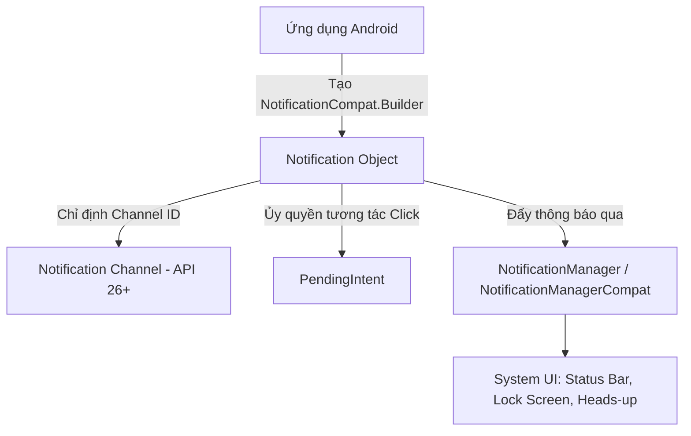
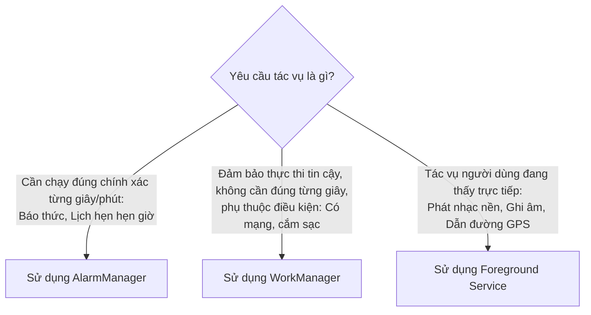

# Chương 11: Thông báo & Lập lịch Tác vụ (Notification & Task Scheduling)

Trong trải nghiệm người dùng trên thiết bị di động, **Notification** đóng vai trò tương tác ngoài ứng dụng (Re-engagement), còn **AlarmManager** và **WorkManager** chịu trách nhiệm lập lịch thực thi các tác vụ nền theo thời gian hoặc điều kiện hệ thống.

---

## 11.1 Hệ thống Thông báo Người dùng (User Notification)

### 1. Kiến trúc và Vị trí Hiển thị
Notification là tin nhắn mà hệ điều hành hiển thị bên ngoài giao diện thông thường của ứng dụng.
- **Các vị trí xuất hiện:**
  - **Status Bar:** Hiển thị icon nhỏ (Small Icon).
  - **Notification Shade:** Ngăn kéo thông báo khi người dùng vuốt từ cạnh trên màn hình xuống.
  - **Heads-up Notification:** Bảng thông báo nổi xuất hiện chốc lát trên đỉnh màn hình khi thiết bị đang mở (thường dùng cho cuộc gọi đến, tin nhắn khẩn cấp).
  - **Lock Screen:** Hiển thị trên màn hình khóa (có thể che giấu nội dung nhạy cảm).
  - **App Icon Badge:** Dấu chấm hoặc con số thông báo chưa đọc trên biểu tượng app.



### 2. Notification Channel (Bắt buộc từ Android 8.0 Oreo - API 26)
Từ Android 8.0, mọi thông báo **bắt buộc phải được gắn vào một Notification Channel**. Nếu không có Channel, thông báo sẽ bị hệ thống âm thầm chặn và không hiển thị.
- **Mục đích:** Trao toàn quyền kiểm soát cho người dùng. Người dùng có thể vào cài đặt hệ thống để tắt thông báo "Khuyến mãi", nhưng vẫn giữ thông báo "Tin nhắn" hoặc "Cảnh báo bảo mật" của cùng một ứng dụng.
- **Mức độ quan trọng (Importance Levels):**
  - `IMPORTANCE_HIGH`: Phát âm thanh và hiển thị Heads-up notification nổi trên màn hình.
  - `IMPORTANCE_DEFAULT`: Phát âm thanh thông báo tiêu chuẩn.
  - `IMPORTANCE_LOW`: Không phát âm thanh, chỉ hiện icon trên status bar.
  - `IMPORTANCE_MIN`: Im lặng hoàn toàn, chỉ hiện khi vuốt ngăn kéo thông báo xuống.

### 3. Khai báo Quyền Thông báo (Android 13 Tiramisu - API 33+)
Từ Android 13, thông báo trở thành một **Runtime Permission**:
- Bắt buộc khai báo trong Manifest:
  ```xml
  <uses-permission android:name="android.permission.POST_NOTIFICATIONS" />
  ```
- Phải dùng `ActivityResultContracts.RequestPermission()` để xin phép người dùng trước khi gọi hàm `notify()`.

### 4. Thành phần `PendingIntent`
`PendingIntent` là một đối tượng ủy quyền chứa một `Intent` bên trong. Nó trao quyền cho một ứng dụng khác (ở đây là tiến trình System UI của hệ điều hành) được phép kích hoạt một Activity, Service hoặc BroadcastReceiver thay mặt ứng dụng của bạn, với chính danh nghĩa và đặc quyền của ứng dụng của bạn, ngay cả khi ứng dụng của bạn đã bị tắt.

> [!IMPORTANT]
> **Yêu cầu cờ Mutable/Immutable từ Android 12 (API 31):**
> Khi tạo `PendingIntent`, bạn **bắt buộc** phải chỉ định rõ cờ `PendingIntent.FLAG_IMMUTABLE` (không thể sửa đổi intent gốc) hoặc `PendingIntent.FLAG_MUTABLE`. Thiếu cờ này sẽ khiến ứng dụng crash với lỗi `IllegalArgumentException`.

### 5. Mã nguồn Triển khai Thông báo Hoàn chỉnh (Kotlin)

```kotlin
class NotificationHelper(private val context: Context) {

    companion object {
        const val CHANNEL_ID = "order_channel"
        const val CHANNEL_NAME = "Thông báo Đơn hàng"
        const val NOTIFICATION_ID = 1001
    }

    // 1. Tạo Notification Channel (thường gọi lúc app vừa khởi chạy)
    fun createNotificationChannel() {
        if (Build.VERSION.SDK_INT >= Build.VERSION_CODES.O) {
            val importance = NotificationManager.IMPORTANCE_HIGH
            val channel = NotificationChannel(CHANNEL_ID, CHANNEL_NAME, importance).apply {
                description = "Cập nhật trạng thái đơn hàng thời gian thực"
                enableLights(true)
                enableVibration(true)
            }
            val notificationManager = context.getSystemService(Context.NOTIFICATION_SERVICE) as NotificationManager
            notificationManager.createNotificationChannel(channel)
        }
    }

    // 2. Xây dựng và hiển thị thông báo
    fun showOrderShippedNotification(orderId: String) {
        // Tạo Intent mở màn hình chi tiết khi click vào thông báo
        val intent = Intent(context, OrderDetailActivity::class.java).apply {
            putExtra("EXTRA_ORDER_ID", orderId)
            flags = Intent.FLAG_ACTIVITY_NEW_TASK or Intent.FLAG_ACTIVITY_CLEAR_TASK
        }

        val pendingIntent = PendingIntent.getActivity(
            context,
            0,
            intent,
            PendingIntent.FLAG_UPDATE_CURRENT or PendingIntent.FLAG_IMMUTABLE
        )

        // Xây dựng giao diện thông báo mở rộng (BigTextStyle)
        val notification = NotificationCompat.Builder(context, CHANNEL_ID)
            .setSmallIcon(R.drawable.ic_delivery) // Bắt buộc phải là icon đơn sắc (silhouette)
            .setContentTitle("Đơn hàng #$orderId đang được giao!")
            .setContentText("Tài xế đang di chuyển đến địa chỉ của bạn.")
            .setStyle(
                NotificationCompat.BigTextStyle()
                    .bigText("Tài xế Nguyễn Văn B đang di chuyển đến địa chỉ của bạn. Dự kiến giao hàng trong 15 phút tới. Vui lòng để ý điện thoại!")
            )
            .setPriority(NotificationCompat.PRIORITY_HIGH)
            .setContentIntent(pendingIntent) // Gắn hành động click
            .setAutoCancel(true) // Tự động xóa thông báo khi người dùng click
            .build()

        // Hiển thị thông báo (cần kiểm tra quyền POST_NOTIFICATIONS trên Android 13+)
        if (ActivityCompat.checkSelfPermission(context, Manifest.permission.POST_NOTIFICATIONS) 
            == PackageManager.PERMISSION_GRANTED) {
            NotificationManagerCompat.from(context).notify(NOTIFICATION_ID, notification)
        }
    }
}
```

---

## 11.2 Lập lịch Tác vụ: AlarmManager vs WorkManager

Trong môi trường di động, việc tiết kiệm pin là yếu tố sống còn. Android áp dụng các cơ chế tiết kiệm năng lượng khắt khe như **Doze Mode** (đưa thiết bị vào trạng thái ngủ sâu khi không cắm sạc và để yên màn hình tắt) và **App Standby**. Do đó, việc lựa chọn công cụ lập lịch phù hợp là cực kỳ quan trọng.



### 1. `AlarmManager` (Báo thức & Tác vụ Thời gian Tuyệt đối)
`AlarmManager` cho phép ứng dụng đăng ký với hệ điều hành một mốc thời gian trong tương lai để hệ thống phát ra một `Intent` (thường gửi tới một `BroadcastReceiver`).
- **Cơ chế hoạt động:** Ngay cả khi thiết bị đang ở chế độ ngủ (Sleep/Doze mode), `AlarmManager` có khả năng **đánh thức CPU (Wake up CPU)** để thực thi công việc.
- **Các loại Alarm:**
  - `ELAPSED_REALTIME` / `ELAPSED_REALTIME_WAKEUP`: Dựa trên khoảng thời gian tính từ lúc máy khởi động (Boot time).
  - `RTC` / `RTC_WAKEUP`: Dựa trên đồng hồ thời gian thực (Wall clock time - UTC).
- **Exact vs Inexact:**
  - `setInexactRepeating()`: Không chạy chính xác từng giây. Hệ thống gom các alarm của nhiều ứng dụng lại để đánh thức CPU cùng một lúc nhằm tiết kiệm pin.
  - `setExactAndAllowWhileIdle()`: Chạy **chính xác tuyệt đối** kể cả khi đang ở chế độ Doze mode. Từ Android 12 (API 31), cần quyền đặc biệt `android.permission.SCHEDULE_EXACT_ALARM`.

#### Ví dụ đặt lịch báo thức với AlarmManager:
```kotlin
val alarmManager = context.getSystemService(Context.ALARM_SERVICE) as AlarmManager
val intent = Intent(context, AlarmReceiver::class.java)
val pendingIntent = PendingIntent.getBroadcast(
    context, 
    0, 
    intent, 
    PendingIntent.FLAG_UPDATE_CURRENT or PendingIntent.FLAG_IMMUTABLE
)

// Đặt báo thức sau 10 phút kể từ bây giờ
val triggerAtMillis = System.currentTimeMillis() + 10 * 60 * 1000

if (Build.VERSION.SDK_INT >= Build.VERSION_CODES.M) {
    alarmManager.setExactAndAllowWhileIdle(
        AlarmManager.RTC_WAKEUP,
        triggerAtMillis,
        pendingIntent
    )
}
```

---

### 2. `WorkManager` (Chuẩn mực Xử lý Nền Hiện đại)
`WorkManager` là một phần của Android Jetpack Architecture Components, là giải pháp **được khuyến nghị chính thức** để xử lý các tác vụ nền có tính chất trì hoãn được nhưng đòi hỏi **đảm bảo thực thi (Guaranteed Execution)**.

- **Đặc tính vượt trội của WorkManager:**
  - **Đảm bảo chạy:** Ngay cả khi ứng dụng bị tắt (Killed) hoặc thiết bị khởi động lại (Reboot), hệ thống vẫn tự động lưu tác vụ vào cơ sở dữ liệu SQLite nội bộ và kích hoạt lại khi đủ điều kiện.
  - **Ràng buộc môi trường (Constraints):** Chỉ chạy khi thỏa mãn các điều kiện:
    - Có kết nối Internet (`NetworkType.CONNECTED` hoặc `NetworkType.UNMETERED` - chỉ chạy khi có Wifi).
    - Thiết bị đang cắm sạc (`setRequiresCharging(true)`).
    - Bộ nhớ thiết bị không bị đầy (`setRequiresStorageNotLow(true)`).
    - Pin không yếu (`setRequiresBatteryNotLow(true)`).
  - **Tương thích ngược:** Tự động lựa chọn cơ chế chạy ngầm tối ưu tùy theo phiên bản Android: `JobScheduler` (từ API 23+) hoặc `AlarmManager + BroadcastReceiver` (ở các bản cũ).

#### Viết một `CoroutineWorker` đồng bộ dữ liệu:
```kotlin
class SyncDataWorker(
    appContext: Context, 
    params: WorkerParameters
) : CoroutineWorker(appContext, params) {

    override suspend fun doWork(): Result {
        return try {
            // Thực hiện tác vụ I/O nặng (tự động chạy trên Dispatchers.Default)
            val isSuccess = uploadOfflineLogsToServer()

            if (isSuccess) {
                Result.success()
            } else {
                // Thử lại sau theo thuật toán Backoff (Exponential Backoff)
                Result.retry()
            }
        } catch (e: Exception) {
            Result.failure()
        }
    }

    private suspend fun uploadOfflineLogsToServer(): Boolean {
        // Giả lập gửi dữ liệu
        delay(2000)
        return true
    }
}
```

#### Lập lịch thực thi với Constraints:
```kotlin
// 1. Thiết lập các ràng buộc
val constraints = Constraints.Builder()
    .setRequiredNetworkType(NetworkType.UNMETERED) // Chỉ chạy khi kết nối Wifi
    .setRequiresCharging(true) // Chỉ chạy khi đang cắm sạc
    .build()

// 2. Tạo WorkRequest (Chạy định kỳ mỗi 6 tiếng)
// Lưu ý: Chu kỳ tối thiểu cho PeriodicWorkRequest là 15 phút!
val syncWorkRequest = PeriodicWorkRequestBuilder<SyncDataWorker>(6, TimeUnit.HOURS)
    .setConstraints(constraints)
    .setBackoffCriteria(BackoffPolicy.EXPONENTIAL, 30, TimeUnit.SECONDS)
    .build()

// 3. Đẩy vào hàng đợi của hệ thống
WorkManager.getInstance(context).enqueueUniquePeriodicWork(
    "UniqueSyncWork",
    ExistingPeriodicWorkPolicy.KEEP,
    syncWorkRequest
)
```

---

## 11.3 Bảng So sánh Tổng hợp: Khi nào dùng công cụ gì?

| Nhu cầu nghiệp vụ | Công cụ chuẩn | Lý do |
| :--- | :--- | :--- |
| **Ứng dụng Đồng hồ Báo thức** | `AlarmManager` (`setExactAndAllowWhileIdle`) | Cần độ chính xác tuyệt đối từng giây, phải đánh thức CPU khi tắt màn hình. |
| **Nhắc nhở lịch hẹn trong ngày** | `AlarmManager` | Đúng mốc thời gian cố định. |
| **Tải ảnh/video lên Cloud khi có Wifi** | `WorkManager` | Cần điều kiện Wifi, đảm bảo chạy xong kể cả khi tắt app. |
| **Đồng bộ hóa Database định kỳ** | `WorkManager` | Chạy nền 6h/lần khi đang cắm sạc. |
| **Phát nhạc MP3 khi tắt màn hình** | `Foreground Service` | Tác vụ thời gian thực người dùng đang theo dõi trực tiếp. |
| **Dẫn đường GPS bằng bản đồ** | `Foreground Service` (Location) | Cần cập nhật tọa độ liên tục mà không bị hệ thống kill. |

---

## 11.4 Tóm tắt & Câu hỏi Ôn tập

### Điểm mấu chốt cần nhớ:
1. **Notification Channel**: Bắt buộc từ Android 8.0 (API 26); chia nhóm thông báo để người dùng tự cấu hình.
2. **PendingIntent**: Ủy quyền thực thi Intent; bắt buộc chỉ định cờ `FLAG_IMMUTABLE` hoặc `FLAG_MUTABLE` từ Android 12.
3. **Quyền thông báo**: Bắt buộc xin quyền runtime `POST_NOTIFICATIONS` từ Android 13.
4. **AlarmManager vs WorkManager**:
   - `AlarmManager`: Dành cho tác vụ phụ thuộc vào mốc thời gian chính xác (Báo thức).
   - `WorkManager`: Dành cho tác vụ nền trì hoãn được, phụ thuộc vào điều kiện môi trường (Wifi, sạc pin) và đảm bảo thực thi 100%.

### Câu hỏi Kiểm tra Hiểu biết:
1. **Tại sao thông báo không hiển thị trên Android 8.0 trở lên dù mã nguồn không hề báo lỗi?**
   - *Trả lời:* Vì ứng dụng chưa tạo `NotificationChannel` hoặc chưa truyền đúng `channelId` vào `NotificationCompat.Builder`. Từ Android 8.0, mọi thông báo thiếu Channel hợp lệ đều bị hệ thống chặn hoàn toàn.
2. **Sự khác biệt căn bản giữa `AlarmManager` và `WorkManager` là gì?**
   - *Trả lời:* `AlarmManager` dựa vào thời gian thực để kích hoạt tác vụ (thường dùng đánh thức thiết bị tại mốc giờ cụ thể), nhưng không thể ràng buộc các điều kiện như có mạng hay sạc pin và không tự động khôi phục tác vụ nếu process bị crash/reboot (trừ khi tự viết code bắt `BOOT_COMPLETED`). Ngược lại, `WorkManager` tập trung vào việc đảm bảo thực thi tác vụ nền khi hội đủ các ràng buộc phần cứng/mạng và tự động lưu trạng thái vào SQLite để sống sót qua mọi sự kiện khởi động lại máy.
3. **Tại sao `PeriodicWorkRequest` trong WorkManager không cho phép đặt chu kỳ lặp lại nhỏ hơn 15 phút?**
   - *Trả lời:* Đây là giới hạn phần cứng và hệ điều hành có chủ đích của Google nhằm ngăn chặn các ứng dụng lạm dụng tác vụ nền liên tục, gây tiêu hao pin nhanh chóng và quá nhiệt thiết bị.
