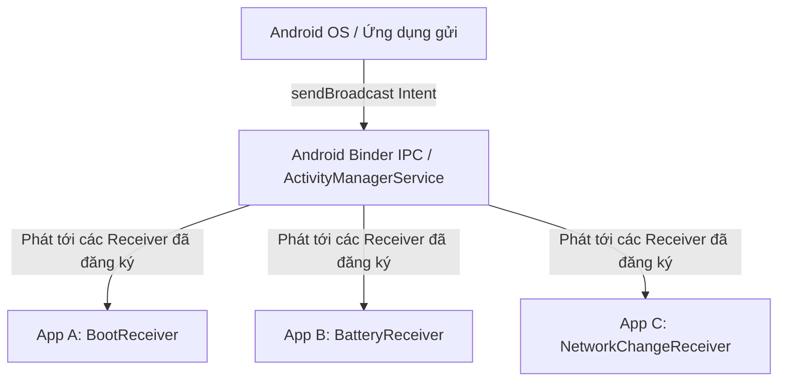
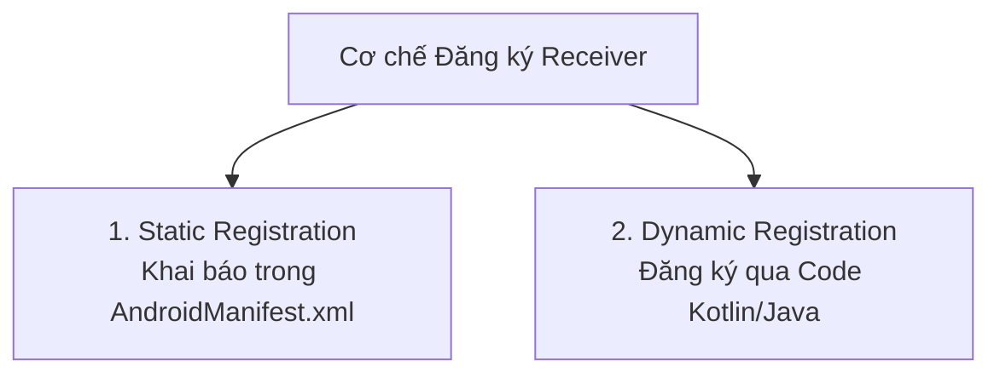

# Chương 12: Bộ thu Phát sóng (BroadcastReceiver)

`BroadcastReceiver` là một trong bốn thành phần cốt lõi của Android, đóng vai trò như một bộ lắng nghe các thông điệp thông báo phát sóng (Broadcast Announcements) từ hệ điều hành hoặc từ các ứng dụng khác theo mô hình **Publish-Subscribe**.

---

## 12.1 Khái niệm & Cơ chế Hoạt động

### 1. Mô hình Publish - Subscribe Toàn Hệ thống
Hệ điều hành Android liên tục phát ra các thông điệp quảng bá khi có các sự kiện hệ thống quan trọng xảy ra:
- Thiết bị hoàn tất khởi động (`Intent.ACTION_BOOT_COMPLETED`).
- Cắm hoặc rút sạc (`Intent.ACTION_POWER_CONNECTED` / `ACTION_POWER_DISCONNECTED`).
- Mức pin xuống quá thấp (`Intent.ACTION_BATTERY_LOW`).
- Người dùng chuyển sang chế độ máy bay (`Intent.ACTION_AIRPLANE_MODE_CHANGED`).

Bất kỳ ứng dụng nào quan tâm đến sự kiện đó đều có thể đăng ký một `BroadcastReceiver` để nhận thông báo và phản hồi tương ứng.



### 2. Vòng đời Cực ngắn của `BroadcastReceiver`
- `BroadcastReceiver` không có giao diện đồ họa.
- Vòng đời của nó **chỉ tồn tại trong suốt thời gian hàm `onReceive(context, intent)` được thực thi**.
- Ngay khi hàm `onReceive()` trả về, hệ thống xem như thành phần này đã hoàn thành công việc và đối tượng receiver có thể bị Garbage Collector dọn dẹp bất cứ lúc nào. Tiến trình chứa nó sẽ bị hạ mức ưu tiên xuống cấp thấp và dễ dàng bị hệ thống thu hồi bộ nhớ (Kill Process).

### 3. Cảnh báo ANR trong `onReceive()`
> [!IMPORTANT]
> **Quy tắc quan trọng:**
> - Phương thức `onReceive()` được kích hoạt trực tiếp trên **Main Thread (UI Thread)**.
> - Nếu công việc bên trong `onReceive()` chạy quá **10 giây**, hệ điều hành sẽ lập tức hiển thị cảnh báo lỗi **ANR (Application Not Responding)**.
> - **Tuyệt đối KHÔNG** thực hiện các tác vụ nặng (Network Request, truy vấn Database phức tạp, nén/giải nén file) trực tiếp bên trong `onReceive()`.
> - **Giải pháp xử lý tác vụ dài:**
>   - Cách 1 (Khuyên dùng): Ủy quyền công việc cho **`WorkManager`** (`WorkManager.getInstance(context).enqueue(...)`).
>   - Cách 2: Gọi `val pendingResult = goAsync()` để kéo dài thời gian hoàn thành tác vụ trên một background thread.

---

## 12.2 Hai Cơ chế Đăng ký: Static vs Dynamic

Lập trình viên có thể đăng ký `BroadcastReceiver` theo 2 cách với những đặc tính và phạm vi hoàn toàn khác nhau:



---

### 1. Đăng ký Tĩnh (Static Registration via Manifest)
Được khai báo trong tệp `AndroidManifest.xml` bằng thẻ `<receiver>`.

```xml
<receiver 
    android:name=".receivers.BootCompletedReceiver"
    android:exported="true">
    <intent-filter>
        <action android:name="android.intent.action.BOOT_COMPLETED" />
    </intent-filter>
</receiver>
```

- **Đặc điểm:** Hệ thống tự động đánh thức (Wake up) và khởi chạy tiến trình ứng dụng của bạn để nhận sự kiện, ngay cả khi ứng dụng đang tắt hoàn toàn (Dead Process).
- **Hạn chế thắt chặt từ Android 8.0 (Oreo - API 26):**
  > [!WARNING]
  > **Lệnh cấm Implicit Broadcasts trong Manifest:**
  > Trước Android 8.0, khi một sự kiện hệ thống xảy ra (ví dụ: cắm sạc hoặc đổi mạng), hàng trăm ứng dụng đăng ký tĩnh cùng lúc bị đánh thức, gây sụt pin nghiêm trọng và lag máy.
  > Từ Android 8.0, Google **cấm hầu hết các Implicit Broadcast được đăng ký trong Manifest**.
  > Chỉ một số rất ít sự kiện ngoại lệ được phép đăng ký tĩnh (ví dụ: `ACTION_BOOT_COMPLETED`, `ACTION_MY_PACKAGE_REPLACED`). Mọi sự kiện khác bắt buộc phải đăng ký bằng Dynamic Registration!

---

### 2. Đăng ký Động (Dynamic Registration via Code)
Được đăng ký và hủy bỏ trực tiếp trong mã nguồn Kotlin (bên trong Activity, Service hoặc Fragment) thông qua `Context`:

- **Quản lý vòng đời đăng ký:**
  - Nếu đăng ký ở `onStart()`, phải hủy ở `onStop()`.
  - Nếu đăng ký ở `onResume()`, phải hủy ở `onPause()`.
  - **Quên gọi `unregisterReceiver()` sẽ gây ra lỗi nghiêm trọng `ReceiverLeakException` (Rò rỉ bộ nhớ).**

#### Yêu cầu cờ `RECEIVER_EXPORTED` từ Android 14 (API 34):
Từ Android 14, khi gọi `registerReceiver()`, bạn **bắt buộc** phải chỉ định rõ cờ:
- `Context.RECEIVER_EXPORTED`: Cho phép nhận broadcast gửi từ các ứng dụng khác trên thiết bị.
- `Context.RECEIVER_NOT_EXPORTED`: Chỉ cho phép nhận broadcast phát ra từ chính ứng dụng của bạn.

#### Mã nguồn Triển khai Receiver Lắng nghe Chế độ Máy bay:
```kotlin
class AirplaneModeReceiver : BroadcastReceiver() {

    override fun onReceive(context: Context, intent: Intent) {
        if (intent.action == Intent.ACTION_AIRPLANE_MODE_CHANGED) {
            val isAirplaneModeOn = intent.getBooleanExtra("state", false)
            val message = if (isAirplaneModeOn) "Chế độ máy bay: ĐANG BẬT" else "Chế độ máy bay: ĐÃ TẮT"
            Toast.makeText(context, message, Toast.LENGTH_SHORT).show()
        }
    }
}

// Trong Activity:
class MainActivity : AppCompatActivity() {

    private val airplaneModeReceiver = AirplaneModeReceiver()

    override fun onStart() {
        super.onStart()
        val filter = IntentFilter(Intent.ACTION_AIRPLANE_MODE_CHANGED)
        
        // Đăng ký động an toàn tương thích từ Android 14 trở lên
        if (Build.VERSION.SDK_INT >= Build.VERSION_CODES.TIRAMISU) {
            registerReceiver(airplaneModeReceiver, filter, Context.RECEIVER_EXPORTED)
        } else {
            registerReceiver(airplaneModeReceiver, filter)
        }
    }

    override fun onStop() {
        super.onStop()
        // Bắt buộc phải hủy đăng ký để tránh rò rỉ bộ nhớ
        unregisterReceiver(airplaneModeReceiver)
    }
}
```

---

## 12.3 Phân loại Broadcast

Android hỗ trợ các loại Broadcast với hành vi khác nhau:

| Loại Broadcast | Hàm kích hoạt | Cơ chế hoạt động |
| :--- | :--- | :--- |
| **Normal Broadcast** (Phổ thông) | `sendBroadcast(intent)` | Hoàn toàn bất đồng bộ. Tất cả các Receiver đủ điều kiện sẽ nhận được thông điệp cùng một lúc, không theo thứ tự nào. Không thể ngăn chặn (abort). |
| **Ordered Broadcast** (Có thứ tự) | `sendOrderedBroadcast(intent, ...)` | Gửi lần lượt tới từng Receiver dựa theo mức độ ưu tiên (`android:priority` trong IntentFilter, từ cao đến thấp). Receiver nhận trước có thể: (1) Đọc/Sửa dữ liệu kết quả (`setResultData()`); (2) Chặn đứng hoàn toàn thông điệp (`abortBroadcast()`) không cho truyền tới các Receiver sau. |
| **Sticky Broadcast** (Dính) | `sendStickyBroadcast()` | **ĐÃ BỊ DEPRECATED** vì lỗ hổng bảo mật và không kiểm soát được trạng thái lưu trữ vĩnh viễn trong RAM. |

---

## 12.4 Giao tiếp Nội bộ Ứng dụng (Internal Broadcasts)

Trước đây, khi các thành phần bên trong cùng một ứng dụng cần gửi tín hiệu cho nhau, lập trình viên thường dùng thư viện `LocalBroadcastManager`.

> [!NOTE]
> **Tại sao `LocalBroadcastManager` bị Deprecated?**
> Thư viện này sử dụng cơ chế Intent và MessageQueue giả lập Broadcast nội bộ, gây dư thừa mã và tiêu tốn tài nguyên không cần thiết.
> **Chuẩn mực thay thế hiện đại:**
> - Sử dụng Kotlin **`SharedFlow`** hoặc **`StateFlow`** thông qua một Shared Event Bus / ViewModel.
> - Đơn giản, an toàn kiểu dữ liệu (Type-safe), và tận dụng toàn bộ sức mạnh bất đồng bộ của Coroutines.

```kotlin
// Tạo một Global Event Bus hiện đại bằng SharedFlow
object AppEventBus {
    private val _events = MutableSharedFlow<AppEvent>()
    val events: SharedFlow<AppEvent> = _events.asSharedFlow()

    suspend fun emitEvent(event: AppEvent) {
        _events.emit(event)
    }
}

sealed class AppEvent {
    data class UserLoggedIn(val username: String) : AppEvent()
    object SessionExpired : AppEvent()
}
```

---

## 12.5 Bảo mật với BroadcastReceiver

Do BroadcastReceiver hoạt động dựa trên cơ chế IPC toàn hệ thống, nó đối mặt với 2 nguy cơ an ninh lớn:

1. **Broadcast Spoofing (Bị ứng dụng độc hại giả mạo broadcast gửi vào app của bạn):**
   - *Phòng tránh:* Nếu receiver chỉ phục vụ công việc nội bộ, hãy luôn đặt thuộc tính **`android:exported="false"`** trong Manifest. Khi đó, hệ điều hành sẽ từ chối tất cả broadcast gửi từ bên ngoài ứng dụng.
2. **Broadcast Eavesdropping (Bị ứng dụng khác nghe lén dữ liệu nhạy cảm mà bạn phát ra):**
   - *Phòng tránh:* Sử dụng **Custom Permission** với cấp độ `protectionLevel="signature"`. Khi gửi `sendBroadcast(intent, "com.example.MY_PERMISSION")`, chỉ những ứng dụng nào được ký cùng một chứng chỉ Keystore với ứng dụng của bạn mới có thể nhận được thông tin.

---

## 12.6 Tóm tắt & Câu hỏi Ôn tập

### Điểm mấu chốt cần nhớ:
1. **Bản chất**: BroadcastReceiver là thành phần lắng nghe sự kiện theo mô hình Publish-Subscribe toàn hệ thống.
2. **Vòng đời ngắn**: Chỉ sống trong thời gian chạy `onReceive()`; không được chạy tác vụ tốn quá 10 giây (gây ANR).
3. **Hạn chế Android 8.0**: Cấm đăng ký tĩnh các Implicit Broadcast trong Manifest.
4. **Quy tắc Android 14**: Đăng ký động bắt buộc phải gắn cờ `RECEIVER_EXPORTED` hoặc `RECEIVER_NOT_EXPORTED`.
5. **Giao tiếp nội bộ**: Chuyển từ `LocalBroadcastManager` sang Kotlin `SharedFlow` / `StateFlow`.

### Câu hỏi Kiểm tra Hiểu biết:
1. **Tại sao hàm `onReceive()` của `BroadcastReceiver` không được phép thực thi các tác vụ mạng (Network Call) hay Database I/O nặng?**
   - *Trả lời:* Vì `onReceive()` chạy trực tiếp trên Main Thread. Việc chạy tác vụ I/O nặng sẽ làm treo UI và kích hoạt lỗi ANR sau 10 giây. Ngoài ra, vòng đời của Receiver sẽ kết thúc ngay khi hàm này trả về; nếu bạn tạo một thread bất đồng bộ thông thường bên trong `onReceive()`, hệ điều hành có thể tiêu diệt tiến trình (Process) trước khi thread đó hoàn thành.
2. **Tại sao Google lại hạn chế việc đăng ký Implicit Broadcast trong `AndroidManifest.xml` kể từ Android 8.0?**
   - *Trả lời:* Để tiết kiệm pin và tài nguyên bộ nhớ cho thiết bị. Nếu hàng chục ứng dụng cùng đăng ký tĩnh một sự kiện (như cắm sạc hay bật Wifi), khi sự kiện đó nổ ra, toàn bộ các ứng dụng đó sẽ đồng loạt bị đánh thức dậy, gây tụt pin nhanh và gián đoạn trải nghiệm của người dùng.
3. **Nếu ứng dụng của bạn cần thực hiện một tác vụ tải dữ liệu nặng sau khi thiết bị khởi động lại (`ACTION_BOOT_COMPLETED`), bạn nên thiết kế giải pháp như thế nào?**
   - *Trả lời:* Đăng ký tĩnh `BootCompletedReceiver` trong Manifest (đây là một trong các ngoại lệ được phép). Trong hàm `onReceive()`, kiểm tra action `BOOT_COMPLETED`, sau đó không thực hiện tải dữ liệu trực tiếp mà gọi `WorkManager.getInstance(context).enqueue(OneTimeWorkRequestBuilder<SyncWorker>().build())` để hệ thống tự động lập lịch và tải dữ liệu an toàn trên background thread.
