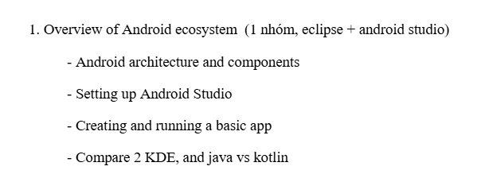

# NT118 - An nam lục cửu

**Phần nội dung thầy yêu cầu có trong bài tập thuyết trình nhóm (seminar)**

## Mục lục repository

- [Seminar](<Seminar/>): Nội dung seminar (thuyết trình ngày 18-9)
    - Gồm 3 chương chính: Android Studio, Kotlin, Gemini in Android Studio
    - [Android_Studio.md](<Seminar/Android_Studio.md/>): Chương 1 - Nội dung về Android và Android Studio
    - [Kotlin.md](<Seminar/Kotlin.md/>): Chương 2 - Nội dung về Kotlin
    - [Gemini_in_Android_Studio.md](<Seminar/Gemini_in_Android_Studio.md/>): Chương 3 - Nội dung về Gemini in Android Studio
    - [questions.md](<Seminar/questions.md/>): Câu hỏi trắc nghiệm tham khảo cho phần Android
    - [(Java_vs_Kotlin)](<Seminar/Java_vs_Kotlin.md/>): Nội dung tham khảo thêm cho phần so sánh Java và Kotlin

- [Nội dung môn học](<Nội dung môn học/>): Toàn bộ nội dung môn học soạn theo đề cương môn học [NT118.R11.pdf](<Nội dung môn học/NT118.R11_.pdf>), phần này dành cho bài tập roadmap môn học

## Phân chia công việc

> Mỗi người tự nghiên cứu và soạn nội dung lại theo cách của mình, kiểm tra thông tin, kiếm hình ảnh phù hợp để tự bỏ vào slide và trình bày phần của mình. Phần nội dung đã soạn trong repo này chỉ là tài liệu tham khảo (claude soạn :v), cần tự kiểm tra lại. Có thể dùng google docs / word / ... để tự note lại phần nội dung của mình

| Thành viên | Phần Seminar phụ trách | Ghi chú |
|-----------|------------------------|-----------------|
| **Thành viên 1** | **1.1** Tổng quan Android *(lịch sử, đặc điểm, quy trình phát triển)* + **1.2** Android Architecture & Components *(kiến trúc 6 tầng, 4 Application Components, Manifest, Activity Lifecycle)* |
| **Thành viên 2** | **1.3** Tổng quan Android Studio *(IDE, SDK, Gradle, Emulator, Logcat, cấu trúc project)* + **1.4** Setting up *(cài đặt, SDK, AVD, thiết bị thật)* + **1.5** Creating & Running Basic App *(Demo)* |
| **Thành viên 3** | **2.1** Tổng quan Kotlin *(lịch sử, đặc điểm, Kotlin-first)* + **2.2** Cú pháp cơ bản *(biến, kiểu dữ liệu, điều kiện, vòng lặp, function, collection)* + **2.3** OOP với Kotlin *(class, kế thừa, interface, data class, sealed class)* |
| **Thành viên 4** | **2.4** Đặc trưng nổi bật *(Null Safety, Extension Function, Lambda, Higher-order Function, Scope Functions, Coroutines)* + **2.5** Java vs Kotlin *(so sánh các tiêu chí, ưu/nhược điểm,...)* + **2.6** Vai trò của Kotlin trong Android |
| **Thành viên 5** | Toàn bộ lý thuyết Gemini in Android Studio *(tổng quan, 6 tính năng, ứng dụng thực tế, lợi ích/hạn chế, Demo nếu kịp - demo việc prompt cho AI code, làm ngầu ngầu tí để ko bị các prompt engineer cười :v)* | |

### Phân chia slide Roadmap môn học

> Slide Roadmap chỉ cần trình bày **tổng quan** mỗi chương – tên chương, các khái niệm chính, và mục tiêu học. Không cần đi sâu.

| Thành viên | Chương Roadmap phụ trách | Chủ đề |
|-----------|--------------------------|--------|
| **Thành viên 1** | **Ch01** Giới thiệu Android Platform + **Ch02** Môi trường phát triển (Dev Environment & Tooling) | Nền tảng Android, SDK, công cụ |
| **Thành viên 2** | **Ch03** Core Components + **Ch04** Activity Lifecycle & Tasks + **Ch05** Intent & Navigation | 4 thành phần cốt lõi, vòng đời, điều hướng |
| **Thành viên 3** | **Ch06** Android Permissions + **Ch07** Fragment | Hệ thống quyền, giao diện phân đoạn |
| **Thành viên 4** | **Ch08** User Interface + **Ch09** Multi-Threading | Giao diện, xử lý đa luồng |
| **Thành viên 5** | **Ch10** Networking + **Ch11** Notification & Alarm + **Ch12** BroadcastReceiver | Mạng, thông báo, broadcast |

